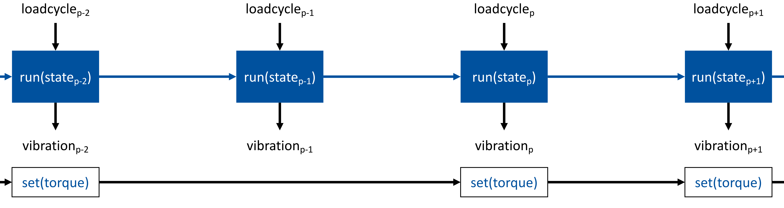
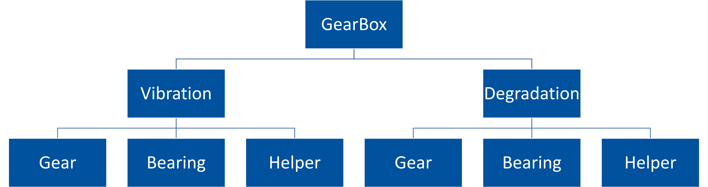
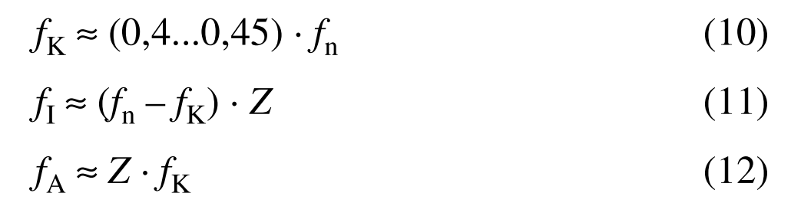
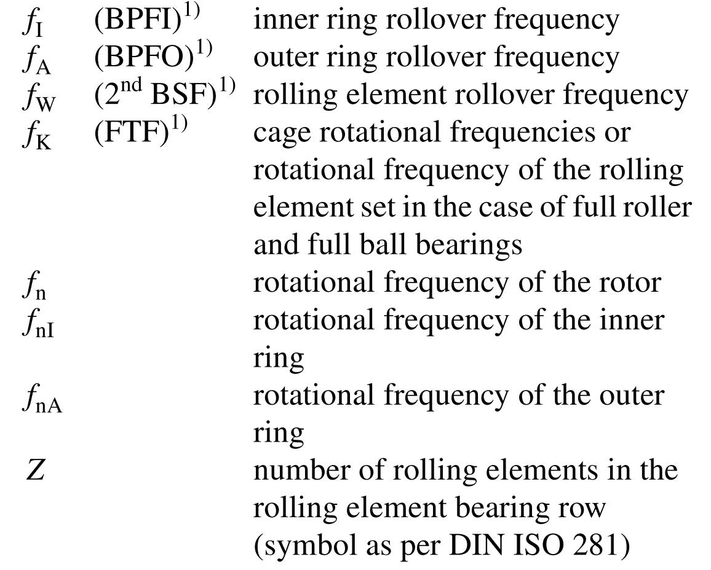
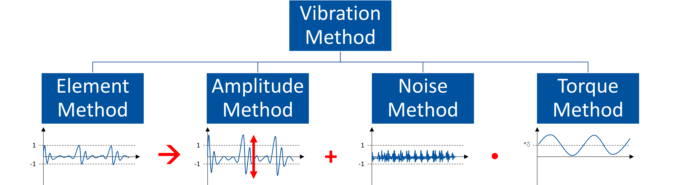
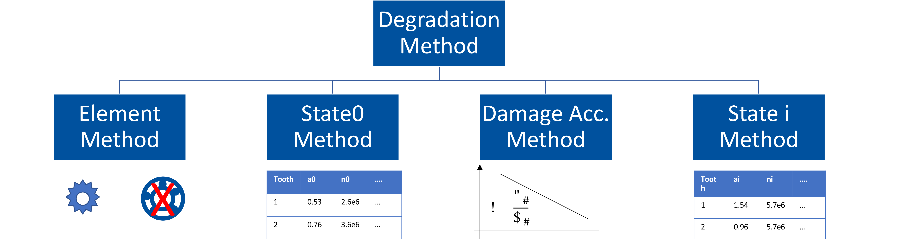

<div style="background-color:rgb(0, 81, 158);color:white;padding:1em;letter-spacing:0.1em;font-size:2em;align=center">
<p><b>Gearbox Simulation Model</b></p>
</div>


<p><b>Simulation of the vibration behaviour of a gearbox under degradation</b></p>


<div style="background-color:rgb(0, 190, 255);color:black;padding:0.5em;letter-spacing:0.1em;font-size:1.5em;align=center">
<p><b>Preliminary</b></p>
</div>

<p> Load Modules </p>


```python
# Build In
import os
from copy import deepcopy as dc
import sys
from IPython.display import display, HTML
# Third Party
import numpy as np
import pandas as pd
from matplotlib import pyplot as plt
from scipy.stats import norm
# from gearbox_functions import gearbox_functions as gf
import gearbox_functions as gf
```

 <p>Define Directories</p>


```python
wd = os.getcwd()
hd = r'####' # Gearbox Toolbox directory  

```

<p>Other</p>


```python
from matplotlib import rcParams
rcParams['figure.figsize'] = [7.4803*4, 4.62309*2]
sizefactor = 2
rcParams['ytick.labelsize'] = 8 * sizefactor
rcParams['xtick.labelsize'] = 8 * sizefactor
rcParams['axes.labelweight'] = 8 * sizefactor
rcParams['axes.titleweight'] = 8 * sizefactor
rcParams.update({'font.size': 8 * sizefactor})
```

<div style="background-color:rgb(0, 190, 255);color:black;padding:0.5em;letter-spacing:0.1em;font-size:1.5em;align=center">
<p><b>Motivation</b></p>
</div><br>
<li>Gear Wheel Pitting</li>
<li>Degradation dominates at one tooth only</li>

<li>Operating Strategy [Gretzinger2017]</li>
<li>Local Stress reduction</li>

<div style="background-color:rgb(0, 81, 158);color:white;padding:1em;letter-spacing:0.1em;font-size:2em;align=center">
<p><b>Brief Introduction</b></p>
</div>
<br>
<li>Toolbox to simulate gearbox vibration</li>
<li>Virtual copy of an existing testbench</li>
  <ul>
    <li>Match on Vibration Spectra</li>
    <li>Match on Gear Degradation</li>
  </ul>
<li>No consideration of:</li>
  <ul>
    <li>Transmission paths formulation (Structure Borne Accoustics)</li>
    <li>Bearing Degradation (not seen in testbench)</li>
  </ul>


<div style="background-color:rgb(0, 190, 255);color:black;padding:0.5em;letter-spacing:0.1em;font-size:1.5em;align=center">
<p><b>State Model</b></p>
</div>
<br>

<li>Acts as a state model:</li>
<li>Executes for a given load cycle (must be greater than the previous)</li>
<li>Optional: Setting a new torque signal at the given load cycle (effecting the following load cycles)</li>
<br>



<div style="background-color:rgb(0, 190, 255);color:black;padding:0.5em;letter-spacing:0.1em;font-size:1.5em;align=center">
<p><b>Inputs and main Methods&#40;&#41;</b></p>
</div>
<br>
<p>General Input Arguments:</p>
<li>f<sub>i</sub>: Rotational Frequency input shaft - in revolutions per second (float)</li>
<li>t<sub>i</sub>: Sample Interval - in seconds (float)</li>
<li>f<sub>s</sub>: Sample Rate - in Hz (float)</li>
<li>seed: Random Generator Seed (integer)</li>

<p>Input Arguments <b>vibrations = model.run()</b>:</p>
<li>n<sub>lc</sub>: Current number of load cycle - in revolutions (float)</li>

<p>Input Arguments <b>model.set()</b>:</p>
<li>n<sub>lc</sub>: Current number of load cycle - in revolutions (float)</li>
<li><a href="torque">torque</a>: Input Torque - in Nm</li>


<div style="background-color:rgb(0, 190, 255);color:black;padding:0.5em;letter-spacing:0.1em;font-size:1.5em;align=center">
<p><b>Torque Definition</b></p>
</div>
<br>

<p><b>Vibration/Degradation Output is calculated for previous given torque<sub>p-1</sub> argument.</b></p>
<p>Given Input Torque will be relevant for the next time steps n<sub>lc</sub></p>

<p>Definition:</p>
<li>Must be defined as array</li>
<li>Each value corresponds to a given time</li>
<li>Function <u>'get_sample_time_torque()'</u> returns the time vector for torque</li>
<li>Length of the torque vector must be at least as long as it takes for running once every possible meshing</li>


<p>Which Torque Applies on which Gear Element</p>
<p>Input Torque applies on:</p>
    <li>Vibration Influence of Gear In, Bearing 1 and Bearing 2</li>
    <li>Load Spectre Calculation of Gear In, Bearing 1,  Bearing 2 and <u>Gear Out</u></li>
<p>Output Torque applies on:</p>
    <li>Vibration Influence of Gear Out, Bearing 3 and Bearing 4</li>
    <li>Load Spectre Calculation of Bearing 3 and Bearing 4</li>

<p><b>Gear Degradation strongly depends on the Gearbox Design &#8594; Both Input and Output Gear Degradation are defined for input torque!!!</b></p>

<div style="background-color:rgb(0, 81, 158);color:white;padding:1em;letter-spacing:0.1em;font-size:2em;align=center">
<p><b>Toolbox Running Example - Definition</b></p>
</div>
<p>Complete High Level Example. Details and Theory will follow.</p>

<p>Load Gearbox Simulation Toolbox:</p>


```python
# os.chdir()
os.chdir(hd)
from gearbox import Gearbox
os.chdir(wd)

```

<p>Define General Input Arguments:</p>


```python
rotational_frequency_in = 5.2 # U/s | float
number_of_load_cycle = 0 # | Must be float in .3f 
sample_interval = 1 # s | float
sample_rate = 5000 # Hz | float
seed = 4 

```

<div style="background-color:rgb(0, 190, 255);color:black;padding:0.5em;letter-spacing:0.1em;font-size:1.5em;align=center">
<p><b>Define Vibration Elements</b></p>
</div>


```python
GearIn = {'no_teeth': 11,                                         # Number of teeth
          'signal': 'gausspulse',                                 # Signal type for gear
          'ampl_method': 'gaussian_repeat',                       # Amplitude Method for inner gear
          'ampl_attributes': {'mu': 4, 'sigma': 0.5},             # Attributes regarding Amplitude Method for gear signal
          'noise_method': None,                             # Noise Method for inner gear
          'noise_attributes': {'mu': 0, 'sigma': 0.25},           # Attributes regarding Noise Method for gear signal
          'torq_method': None,                                    # Torque Influence Method for inner gear
          'torq_attributes': {'scale_min': 0,                     # Attributes regarding Torque Influence Method for gear signal
                              'scale_max': 0.2,
                               'value_min': 0,
                               'value_max': 50,
                              'norm_divisor': 200,
                              'exponent': 2},           
          }

GearOut = {'no_teeth': 21,                                        # Number of teeth
           'signal': 'gausspulse',                                # Signal type for gear
           'ampl_method': 'gaussian_repeat',                      # Amplitude Method for inner gear
           'ampl_attributes': {'mu': 3, 'sigma': 0.5},            # Attributes regarding Amplitude Method for gear signal
           'noise_method': None,                            # Noise Method for inner gear
           'noise_attributes': {'mu': 0, 'sigma': 0.25},          # Attributes regarding Noise Method for gear signal
           'torq_method': None,                                   # Torque Influence Method for inner gear
           'torq_attributes': {'scale_min': 0,                    # Attributes regarding Torque Influence Method for gear signal
                               'scale_max': 0.2,
                               'value_min': 0,
                               'value_max': 50,
                               'norm_divisor': 1,
                               'exponent': 4},           
          }
```


```python
# General Definition of Amplitudes etc. (can be also defined seperatedly for each Bearing)
BearingI =   {# Inner Ring Rollover
             'signal_iring': 'sine',                               # Signal type for inner cage
             'ampl_method_iring': 'const',                         # Amplitude Method for inner cage signal (Repeat methods are not working for bearings)
             'ampl_attributes_iring': {'constant': 2.5},           # Attributes regarding Amplitude Method for inner cage signal
             'noise_method_iring': 'gaussian',                     # Noise Method for inner gear
             'noise_attributes_iring': {'mu': 0, 'sigma': 0.05},   # Attributes regarding Noise Method for gear signal
             'torq_method_iring': None,                         # Torque Influence Method for rolling element
             'torq_attributes_iring': {'scale_min': 0,          # Attributes regarding Torque Influence Method for rolling element signal
                                       'scale_max': 0.1,
                                       'value_min': 0,
                                       'value_max': 50,
                                       'norm_divisor': 1,
                                       'exponent': 4},           

             # Rolling Element:
             'signal_relement': 'sine',                            # Signal type for rolling element
             'ampl_method_relement': 'const',                      # Amplitude Method for rolling element signal (Repeat methods are not working for bearings)
             'ampl_attributes_relement': {'constant': 1.2},        # Attributes regarding Amplitude Method for rolling element signal
             'noise_method_relement': 'gaussian',                  # Noise Method for rolling element
             'noise_attributes_relement': {'mu': 0, 'sigma': 0.05},# Attributes regarding Noise Method for gear signal
             'torq_method_relement': None,                         # Torque Influence Method for rolling element
             'torq_attributes_relement': {'scale_min': 0,          # Attributes regarding Torque Influence Method for rolling element signal
                                          'scale_max': 0.1,
                                          'value_min': 0,
                                          'value_max': 50,
                                          'norm_divisor': 1,
                                          'exponent': 4},
             # Outer Ring Rollover
             'signal_oring': 'sine',                               # Signal type for inner cage
             'ampl_method_oring': 'const',                         # Amplitude Method for inner cage signal (Repeat methods are not working for bearings)
             'ampl_attributes_oring': {'constant': 2.5},           # Attributes regarding Amplitude Method for inner cage signal
             'noise_method_oring': 'gaussian',                     # Noise Method for inner gear
             'noise_attributes_oring': {'mu': 0, 'sigma': 0.05},   # Attributes regarding Noise Method for gear signal
             'torq_method_oring': None,                         # Torque Influence Method for rolling element
             'torq_attributes_oring': {'scale_min': 0,          # Attributes regarding Torque Influence Method for rolling element signal
                                       'scale_max': 0.1,
                                       'value_min': 0,
                                       'value_max': 50,
                                       'norm_divisor': 1,
                                       'exponent': 4},          
            }

```


```python
Bearing1 = {**{'no_elements': 11}, **BearingI}                     # Number of rolling elements
Bearing2 = {**{'no_elements': 9}, **BearingI}                     # Number of rolling elements
Bearing3 = {**{'no_elements': 13}, **BearingI}                     # Number of rolling elements
Bearing4 = {**{'no_elements': 12}, **BearingI}                     # Number of rolling elements

```

<div style="background-color:rgb(0, 190, 255);color:black;padding:0.5em;letter-spacing:0.1em;font-size:1.5em;align=center">
<p><b>Define Degradation Elements</b></p>
</div>


```python
# Reference Value for PDFs is given for load defined 'Whoeler' 'torqp'

Deg_GearIn = {'Failing_Teeth': 2,                                      # Number of Teeth falling at Gear
              'Chances': {'neighbouring': 1,                           # Chance that multiple falling teeth are neighbouring 
                          'opposite': 1,                               # Chance that multiple falling teeth are opposite to each other 
                          'keeporder': 10},                            # Chance that multiple falling teeth are keeping order from init to eol
              'PDF_Deg_Init': {'n': norm(loc=6.875e6, scale=1.053e6),  # P(n_0) n in Load Cycles (ref: input shaft)
                               'a': norm(loc=0.450, scale=0.305)},     # P(a_0) a in %
              'PDF_Deg_EOL': {'n': norm(loc=10390000, scale=1.053e6),  # P(n_eol) n in Load Cycles (ref: input shaft)
                              'a': norm(loc=4.0, scale=0.)},           # P(a_eol) a in %
              'Woehler': {'k': 8.5,                                   # Woehler Exponent 
                          'np': 10390000,                              # Woehler Reference n in Load Cycles (ref: input shaft)
                          'torqp': 200},                               # Woehler Reference sigma in Nm
              'GridSearch': {'slice_theta1': (0.0001, 0.0902, 0.01),   # Grid for function a = theta1 * exp(theta2 * n) + theta3 defined in slices
                             'slice_theta2': (0.10/1e6, 1.51/1e6, 0.2/1e6), #tbd change step to 0.02/1e6
                             'slice_theta3':(-2.0, 0.5, 0.1)}
             }
 
Deg_GearOut = {'Failing_Teeth': 3,                                      # Number of Teeth falling at Gear
               'Chances': {'neighbouring': 2,                           # Chance that multiple falling teeth are neighbouring 
                           'opposite': 2,                               # Chance that multiple falling teeth are opposite to each other 
                           'keeporder': 10},                            # Chance that multiple falling teeth are keeping order from init to eol
               'PDF_Deg_Init': {'n': norm(loc=6.875e6, scale=1.053e6),  # P(n_0) n in Load Cycles (ref: input shaft)
                                'a': norm(loc=0.450, scale=0.305)},     # P(a_0) a in %
               'PDF_Deg_EOL': {'n': norm(loc=10390000, scale=1.053e6),  # P(n_eol) n in Load Cycles (ref: input shaft)
                               'a': norm(loc=4.0, scale=0.)},           # P(a_eol) a in %
               'Woehler': {'k': 8.5,                                   # Woehler Exponent 
                           'np': 10390000,                              # Woehler Reference n in Load Cycles (ref: input shaft)
                           'torqp': 200},                               # Woehler Reference sigma in Nm
               'GridSearch': {'slice_theta1': (0.0001, 0.0902, 0.01),   # Grid for function a = theta1 * exp(theta2 * n) + theta3 defined in slices
                              'slice_theta2': (0.10/1e6, 1.51/1e6, 0.2/1e6), #tbd change step to 0.02/1e6
                              'slice_theta3':(-2.0, 0.5, 0.1)}
              }
```


```python
Deg_Bearing1 = 'tbd'
Deg_Bearing2 = 'tbd'
Deg_Bearing3 = 'tbd'
Deg_Bearing4 = 'tbd'
```

<div style="background-color:rgb(0, 190, 255);color:black;padding:0.5em;letter-spacing:0.1em;font-size:1.5em;align=center">
<p><b>Define Degradation-Vibration-Dependencie</b></p>
</div>


```python
GearDegVibDictIn = {'signal': 'gausspulse',                                 # Signal type for gear
                       'fc_factor': 4*rotational_frequency_in,                                      # fc = frequency * fc_factor (see gauspulse defintion)
                       'bw_factor': 0.5,                                    # see gauspulse defintion
                       'bwr_factor': -6,                                    # see gauspulse defintion
                       'scale_method': 'linear',                            # Scale Method (See Torque Influence Method)
                       'scale_attributes': {'scale_min': 0,                 # Attributes regarding Scale Method for gear signal (see Torque Influence Method)
                                           'scale_max': 10,
                                           'value_min': 0,
                                           'value_max': 2,
                                           'exponent': 2},
                       'torq_influence': True,                              # If True Torque Influence will be taken into account in the same way as in vibration definition
                       'noise_method': 'gaussian',                          # Noise Method
                       'noise_attributes': {'mu': 0, 'sigma': 0.005},       # Attributes regarding Noise Method for
                       't2t_factor': 1,
                       }

GearDegVibDictOut = {'signal': 'gausspulse',                                # Signal type for gear
                       'fc_factor': 4**rotational_frequency_in,                                      # fc = frequency * fc_factor (see gauspulse defintion)
                       'bw_factor': 0.5,                                    # see gauspulse defintion
                       'bwr_factor': -6,                                    # see gauspulse defintion
                       'scale_method': 'linear',                            # Scale Method (See Torque Influence Method)
                       'scale_attributes': {'scale_min': 0,                 # Attributes regarding Scale Method for gear signal (see Torque Influence Method)
                                           'scale_max': 10,
                                           'value_min': 0,
                                           'value_max': 2,
                                           'exponent': 2},
                       'torq_influence': True,                              # If True Torque Influence will be taken into account in the same way as in vibration definition
                       'noise_method': 'gaussian',                          # Noise Method
                       'noise_attributes': {'mu': 0, 'sigma': 0.005},       # Attributes regarding Noise Method for
                       't2t_factor': 1,
                       }

```

<div style="background-color:rgb(0, 190, 255);color:black;padding:0.5em;letter-spacing:0.1em;font-size:1.5em;align=center">
<p><b>Torque Definition (Workaround)</b></p>
</div>


```python
sample_time = gf.get_sample_time_torque(rotational_frequency_in, sample_rate, GearIn['no_teeth'], GearOut['no_teeth'])
torque_in = np.sin((2 * np.pi * rotational_frequency_in * sample_time)) * 5 + 200 # Nm | array
```

<div style="background-color:rgb(0, 81, 158);color:white;padding:1em;letter-spacing:0.1em;font-size:2em;align=center">
<p><b>Toolbox Running Example - Run</b></p>
</div>
<div style="background-color:rgb(0, 190, 255);color:black;padding:0.5em;letter-spacing:0.1em;font-size:1.5em;align=center">
<p><b>Instance Initialization</b></p>
</div>
<br>
<p>Initialize a new Instance:</p>


```python
model = Gearbox(# Vibration Arguments
                rotational_frequency_in,
                sample_interval, sample_rate,
                GearIn, GearOut,
                Bearing1, Bearing2, Bearing3, Bearing4,
                # Degradation Arguments
                Deg_GearIn, Deg_GearOut,
                Deg_Bearing1, Deg_Bearing2, Deg_Bearing3, Deg_Bearing4,
                # Shared Arguments
                seed=seed, 
                fixed_start=True,
                GearDegVibDictIn=GearDegVibDictIn,
                GearDegVibDictOut=GearDegVibDictOut)
```

<div style="background-color:rgb(0, 190, 255);color:black;padding:0.5em;letter-spacing:0.1em;font-size:1.5em;align=center">
<p><b>Run <u>only</u> Vibration</b></p>
</div>
<br>
<p>Initialize Vibration Module: <b>init_vibration(torque)</b></p>
<p>Input Arguments:</p>
<li>Input Torque</li>
<p>Returns:</p>
<li>-</li>


```python
model.Vibration.init_vibration(torque_in)
```

<p>Get Loads from Torque: <b>get_loads(torque)</b></p>
<p>Input Arguments:</p>
<li>Input Torque</li>
<p>Returns:</p>
<li>Loads Dictionary</li>


```python
loads = model.Vibration.get_loads(torque_in)

df_loads = pd.DataFrame(loads)
df_loads.index = df_loads.index.astype(dtype='int32')
df_loads = df_loads.sort_index()

```


```python
df_loads

```


<div>
<table border="1" class="dataframe">
  <thead>
    <tr style="text-align: right;">
      <th></th>
      <th>GearIn</th>
      <th>GearOut</th>
      <th>Bearing1</th>
      <th>Bearing2</th>
      <th>Bearing3</th>
      <th>Bearing4</th>
    </tr>
  </thead>
  <tbody>
    <tr>
      <td>1</td>
      <td>[200.6817258938662, 199.98264304525793, 199.96...</td>
      <td>[200.6817258938662, 197.31505718393504, 195.49...</td>
      <td>tbd</td>
      <td>tbd</td>
      <td>tbd</td>
      <td>tbd</td>
    </tr>
    <tr>
      <td>2</td>
      <td>[202.62853435886845, 202.64111177836386, 202.6...</td>
      <td>[202.62853435886845, 199.96528630540217, 197.3...</td>
      <td>tbd</td>
      <td>tbd</td>
      <td>tbd</td>
      <td>tbd</td>
    </tr>
    <tr>
      <td>3</td>
      <td>[204.47605246180117, 204.46872938665337, 204.4...</td>
      <td>[204.47605246180117, 202.62643579473837, 199.9...</td>
      <td>tbd</td>
      <td>tbd</td>
      <td>tbd</td>
      <td>tbd</td>
    </tr>
    <tr>
      <td>4</td>
      <td>[204.88825602091026, 204.8862356892104, 204.88...</td>
      <td>[204.88825602091026, 204.4750096988814, 202.65...</td>
      <td>tbd</td>
      <td>tbd</td>
      <td>tbd</td>
      <td>tbd</td>
    </tr>
    <tr>
      <td>5</td>
      <td>[203.7417678604638, 203.75305523806313, 203.74...</td>
      <td>[203.7417678604638, 204.88858842058818, 204.47...</td>
      <td>tbd</td>
      <td>tbd</td>
      <td>tbd</td>
      <td>tbd</td>
    </tr>
    <tr>
      <td>6</td>
      <td>[201.42261349854877, 201.40836172680946, 201.4...</td>
      <td>[201.42261349854877, 203.74338318244688, 204.8...</td>
      <td>tbd</td>
      <td>tbd</td>
      <td>tbd</td>
      <td>tbd</td>
    </tr>
    <tr>
      <td>7</td>
      <td>[198.65592789803515, 198.64161950289116, 198.6...</td>
      <td>[198.65592789803515, 201.42498753929806, 203.7...</td>
      <td>tbd</td>
      <td>tbd</td>
      <td>tbd</td>
      <td>tbd</td>
    </tr>
    <tr>
      <td>8</td>
      <td>[196.29073656906985, 196.3022018523581, 196.29...</td>
      <td>[196.29073656906985, 198.62732346333246, 201.4...</td>
      <td>tbd</td>
      <td>tbd</td>
      <td>tbd</td>
      <td>tbd</td>
    </tr>
    <tr>
      <td>9</td>
      <td>[195.12340552714028, 195.12118534653806, 195.1...</td>
      <td>[195.12340552714028, 196.29237165842147, 198.6...</td>
      <td>tbd</td>
      <td>tbd</td>
      <td>tbd</td>
      <td>tbd</td>
    </tr>
    <tr>
      <td>10</td>
      <td>[195.50333012295354, 195.49622128638393, 195.5...</td>
      <td>[195.50333012295354, 195.12377987024195, 196.2...</td>
      <td>tbd</td>
      <td>tbd</td>
      <td>tbd</td>
      <td>tbd</td>
    </tr>
    <tr>
      <td>11</td>
      <td>[197.3025887660451, 197.31505718393504, 197.30...</td>
      <td>[197.3025887660451, 195.50231116440438, 195.12...</td>
      <td>tbd</td>
      <td>tbd</td>
      <td>tbd</td>
      <td>tbd</td>
    </tr>
    <tr>
      <td>12</td>
      <td>NaN</td>
      <td>[199.98264304525793, 197.30051307870085, 195.5...</td>
      <td>tbd</td>
      <td>tbd</td>
      <td>tbd</td>
      <td>tbd</td>
    </tr>
    <tr>
      <td>13</td>
      <td>NaN</td>
      <td>[202.64111177836386, 199.98016349282457, 197.2...</td>
      <td>tbd</td>
      <td>tbd</td>
      <td>tbd</td>
      <td>tbd</td>
    </tr>
    <tr>
      <td>14</td>
      <td>NaN</td>
      <td>[204.46872938665337, 202.63901720696384, 199.9...</td>
      <td>tbd</td>
      <td>tbd</td>
      <td>tbd</td>
      <td>tbd</td>
    </tr>
    <tr>
      <td>15</td>
      <td>NaN</td>
      <td>[204.8862356892104, 204.4676787146322, 202.636...</td>
      <td>tbd</td>
      <td>tbd</td>
      <td>tbd</td>
      <td>tbd</td>
    </tr>
    <tr>
      <td>16</td>
      <td>NaN</td>
      <td>[203.75305523806313, 204.88657549807294, 204.4...</td>
      <td>tbd</td>
      <td>tbd</td>
      <td>tbd</td>
      <td>tbd</td>
    </tr>
    <tr>
      <td>17</td>
      <td>NaN</td>
      <td>[201.40836172680946, 203.75466393081751, 204.8...</td>
      <td>tbd</td>
      <td>tbd</td>
      <td>tbd</td>
      <td>tbd</td>
    </tr>
    <tr>
      <td>18</td>
      <td>NaN</td>
      <td>[198.64161950289116, 201.41073791519926, 203.7...</td>
      <td>tbd</td>
      <td>tbd</td>
      <td>tbd</td>
      <td>tbd</td>
    </tr>
    <tr>
      <td>19</td>
      <td>NaN</td>
      <td>[196.3022018523581, 198.64400338090186, 201.41...</td>
      <td>tbd</td>
      <td>tbd</td>
      <td>tbd</td>
      <td>tbd</td>
    </tr>
    <tr>
      <td>20</td>
      <td>NaN</td>
      <td>[195.12118534653806, 196.28257518840692, 198.6...</td>
      <td>tbd</td>
      <td>tbd</td>
      <td>tbd</td>
      <td>tbd</td>
    </tr>
    <tr>
      <td>21</td>
      <td>NaN</td>
      <td>[195.49622128638393, 195.12155229545505, 196.2...</td>
      <td>tbd</td>
      <td>tbd</td>
      <td>tbd</td>
      <td>tbd</td>
    </tr>
  </tbody>
</table>
</div>


<p>Get Vibration Signal: <b>run_vibration(nolc, torque, statei=None, output=True)</b></p>
<p>Input Arguments:</p>
<li>nolc: current number of load cycle</li>
<li>torque: Input Torque</li>
<li>statei: current degradation state</li>
<li>output: if true method returns vibration signal</li>
<p>Returns:</p>
<li>vibration signal</li>


```python
vibration = model.Vibration.run_vibration(number_of_load_cycle, torque_in, statei=None, output=True)
```


```python
plt.plot(np.arange(0, sample_interval, 1/sample_rate), vibration)
plt.xlabel('Time in seconds'), plt.ylabel('Acceleration in g'), plt.legend(['Vibration Signal'])
plt.show()
```


<p>Summarize Vibration: <b>summary_vibration()</b></p>


```python
model.Vibration.summary_vibration()
```


<h3>Controls</h3>


<h3>Accumulated Signal</h3>


<h3>Bearing 1 Signal</h3>


<h3>Bearing 2 Signal</h3>


<h3>Bearing 3 Signal</h3>


<h3>Bearing 4 Signal</h3>


<h3>Degradation Signal</h3>


<p>Degradation not available (probably no statei argument given)</p>


<h3>Gear Signals</h3>


<div style="background-color:rgb(0, 190, 255);color:black;padding:0.5em;letter-spacing:0.1em;font-size:1.5em;align=center">
<p><b>Run <u>only</u> Degradation</b></p>
</div>
<br>
<p>Initialize Degradation Module: <b>init_degradation()</b></p>
<p>Input Arguments:</p>
<p>Returns:</p>
<li>statei: DataFrame containing the degradation states</li>


```python
statei = model.Degradation.init_degradation()

```


<p><u>Gear in:</u></p>


<p>Running for tooth 7 failure</p>


    [================================================================================] 2000/2000  


<p>Running for tooth 3 failure</p>


    [================================================================================] 2000/2000  

    \\imapc\benutzer\Mitarbeiterdaten\henss\_02_software\_08_github\Gearbox\gearbox\degradation\helper\__init__.py:181: RuntimeWarning: invalid value encountered in log
      x = np.log((y - theta3) / theta1) / theta2
    


<p><u>Gear out:</u></p>


<p>Running for tooth 12 failure</p>


    [================================================================================] 2000/2000  


<p>Running for tooth 5 failure</p>


    [================================================================================] 2000/2000  


<p>Running for tooth 14 failure</p>


    [================================================================================] 2000/2000  


```python
pd.DataFrame(statei['GearIn'])

```


<div>
<table border="1" class="dataframe">
  <thead>
    <tr style="text-align: right;">
      <th></th>
      <th>1.0</th>
      <th>2.0</th>
      <th>3.0</th>
      <th>4.0</th>
      <th>5.0</th>
      <th>6.0</th>
      <th>7.0</th>
      <th>8.0</th>
      <th>9.0</th>
      <th>10.0</th>
      <th>11.0</th>
    </tr>
  </thead>
  <tbody>
    <tr>
      <td>$a_{0}$</td>
      <td>NaN</td>
      <td>NaN</td>
      <td>NaN</td>
      <td>NaN</td>
      <td>NaN</td>
      <td>NaN</td>
      <td>NaN</td>
      <td>NaN</td>
      <td>NaN</td>
      <td>NaN</td>
      <td>NaN</td>
    </tr>
    <tr>
      <td>$d_{0}$</td>
      <td>NaN</td>
      <td>NaN</td>
      <td>NaN</td>
      <td>NaN</td>
      <td>NaN</td>
      <td>NaN</td>
      <td>-1.434069</td>
      <td>NaN</td>
      <td>NaN</td>
      <td>NaN</td>
      <td>NaN</td>
    </tr>
  </tbody>
</table>
</div>


```python
pd.DataFrame(statei['GearOut'])

```


<div>
<table border="1" class="dataframe">
  <thead>
    <tr style="text-align: right;">
      <th></th>
      <th>1.0</th>
      <th>2.0</th>
      <th>3.0</th>
      <th>4.0</th>
      <th>5.0</th>
      <th>6.0</th>
      <th>7.0</th>
      <th>8.0</th>
      <th>9.0</th>
      <th>10.0</th>
      <th>...</th>
      <th>12.0</th>
      <th>13.0</th>
      <th>14.0</th>
      <th>15.0</th>
      <th>16.0</th>
      <th>17.0</th>
      <th>18.0</th>
      <th>19.0</th>
      <th>20.0</th>
      <th>21.0</th>
    </tr>
  </thead>
  <tbody>
    <tr>
      <td>$a_{0}$</td>
      <td>NaN</td>
      <td>NaN</td>
      <td>NaN</td>
      <td>NaN</td>
      <td>NaN</td>
      <td>NaN</td>
      <td>NaN</td>
      <td>NaN</td>
      <td>NaN</td>
      <td>NaN</td>
      <td>...</td>
      <td>NaN</td>
      <td>NaN</td>
      <td>NaN</td>
      <td>NaN</td>
      <td>NaN</td>
      <td>NaN</td>
      <td>NaN</td>
      <td>NaN</td>
      <td>NaN</td>
      <td>NaN</td>
    </tr>
    <tr>
      <td>$d_{0}$</td>
      <td>NaN</td>
      <td>NaN</td>
      <td>NaN</td>
      <td>NaN</td>
      <td>-1.671099</td>
      <td>NaN</td>
      <td>NaN</td>
      <td>NaN</td>
      <td>NaN</td>
      <td>NaN</td>
      <td>...</td>
      <td>-1.382792</td>
      <td>NaN</td>
      <td>-0.391062</td>
      <td>NaN</td>
      <td>NaN</td>
      <td>NaN</td>
      <td>NaN</td>
      <td>NaN</td>
      <td>NaN</td>
      <td>NaN</td>
    </tr>
  </tbody>
</table>
<p>2 rows × 21 columns</p>
</div>


<p>Summarize Vibration: <b>summary_vibration()</b></p>


```python
model.Degradation.summary_degradation()
```


<h1>Degradation Gear In</h1>


<h3>State 0 Parameter (Ref. Torque: 200.000 Nm)</h3>


<div>
<table border="1" class="dataframe">
  <thead>
    <tr style="text-align: right;">
      <th></th>
      <th>a0</th>
      <th>n0</th>
      <th>tooth</th>
      <th>neol</th>
      <th>aeol</th>
      <th>theta1</th>
      <th>theta2</th>
      <th>theta3</th>
      <th>n0_old</th>
      <th>neol_old</th>
    </tr>
  </thead>
  <tbody>
    <tr>
      <td>0</td>
      <td>0.661548</td>
      <td>5.161122e+06</td>
      <td>7</td>
      <td>8.760057e+06</td>
      <td>4.0</td>
      <td>0.0501</td>
      <td>5.000000e-07</td>
      <td>1.776357e-15</td>
      <td>5.656872e+06</td>
      <td>8.721440e+06</td>
    </tr>
    <tr>
      <td>1</td>
      <td>0.100020</td>
      <td>NaN</td>
      <td>3</td>
      <td>1.175231e+07</td>
      <td>4.0</td>
      <td>0.0101</td>
      <td>5.000000e-07</td>
      <td>4.000000e-01</td>
      <td>5.839910e+06</td>
      <td>1.112036e+07</td>
    </tr>
  </tbody>
</table>
</div>


<h3>State 0 Degradation Model Plot (Ref. Torque: 200.000 Nm)</h3>


<h3>Damage Accumulation (until load cycle 0)</h3>


<div>
<table border="1" class="dataframe">
  <thead>
    <tr style="text-align: right;">
      <th></th>
      <th>0</th>
    </tr>
  </thead>
  <tbody>
    <tr>
      <td>0</td>
      <td>-1.434069</td>
    </tr>
    <tr>
      <td>1</td>
      <td>NaN</td>
    </tr>
  </tbody>
</table>
</div>


<p>Legend: Row: 0 <=> Tooth: 7 | Row: 1 <=> Tooth: 3)</p>


<h3>Pitting Growth (until load cycle 0)</h3>


<div>
<table border="1" class="dataframe">
  <thead>
    <tr style="text-align: right;">
      <th></th>
      <th>0</th>
    </tr>
  </thead>
  <tbody>
    <tr>
      <td>0</td>
      <td>NaN</td>
    </tr>
    <tr>
      <td>1</td>
      <td>NaN</td>
    </tr>
  </tbody>
</table>
</div>


<p>Legend: Row: 0 <=> Tooth: 7 | Row: 1 <=> Tooth: 3)</p>


<h1>Degradation Gear Out</h1>


<h3>State 0 Parameter (Ref. Torque: 200.000 Nm)</h3>


<div>
<table border="1" class="dataframe">
  <thead>
    <tr style="text-align: right;">
      <th></th>
      <th>a0</th>
      <th>n0</th>
      <th>tooth</th>
      <th>neol</th>
      <th>aeol</th>
      <th>theta1</th>
      <th>theta2</th>
      <th>theta3</th>
      <th>n0_old</th>
      <th>neol_old</th>
    </tr>
  </thead>
  <tbody>
    <tr>
      <td>0</td>
      <td>0.579647</td>
      <td>5.342086e+06</td>
      <td>12</td>
      <td>9.205347e+06</td>
      <td>4.0</td>
      <td>0.0401</td>
      <td>5.000000e-07</td>
      <td>1.776357e-15</td>
      <td>4.391948e+06</td>
      <td>9.341308e+06</td>
    </tr>
    <tr>
      <td>1</td>
      <td>0.551336</td>
      <td>6.623250e+06</td>
      <td>5</td>
      <td>1.058666e+07</td>
      <td>4.0</td>
      <td>0.0201</td>
      <td>5.000000e-07</td>
      <td>1.776357e-15</td>
      <td>5.441903e+06</td>
      <td>1.073986e+07</td>
    </tr>
    <tr>
      <td>2</td>
      <td>0.146248</td>
      <td>2.587852e+06</td>
      <td>14</td>
      <td>9.205347e+06</td>
      <td>4.0</td>
      <td>0.0401</td>
      <td>5.000000e-07</td>
      <td>1.776357e-15</td>
      <td>5.601978e+06</td>
      <td>9.354910e+06</td>
    </tr>
  </tbody>
</table>
</div>


<h3>State 0 Degradation Model Plot (Ref. Torque: 200.000 Nm)</h3>


<h3>Damage Accumulation (until load cycle 0)</h3>


<div>
<table border="1" class="dataframe">
  <thead>
    <tr style="text-align: right;">
      <th></th>
      <th>0</th>
    </tr>
  </thead>
  <tbody>
    <tr>
      <td>0</td>
      <td>-1.382792</td>
    </tr>
    <tr>
      <td>1</td>
      <td>-1.671099</td>
    </tr>
    <tr>
      <td>2</td>
      <td>-0.391062</td>
    </tr>
  </tbody>
</table>
</div>


<p>Legend: Row: 0 <=> Tooth: 12 | Row: 1 <=> Tooth: 5 | Row: 2 <=> Tooth: 14)</p>


<h3>Pitting Growth (until load cycle 0)</h3>


<div>
<table border="1" class="dataframe">
  <thead>
    <tr style="text-align: right;">
      <th></th>
      <th>0</th>
    </tr>
  </thead>
  <tbody>
    <tr>
      <td>0</td>
      <td>NaN</td>
    </tr>
    <tr>
      <td>1</td>
      <td>NaN</td>
    </tr>
    <tr>
      <td>2</td>
      <td>NaN</td>
    </tr>
  </tbody>
</table>
</div>


<p>Legend: Row: 0 <=> Tooth: 12 | Row: 1 <=> Tooth: 5 | Row: 2 <=> Tooth: 14)</p>


<p>Get Degradation Growth: <b>run_degradation(nolc, loads)</b></p>
<p>Input Arguments:</p>
<li>nolc: current number of load cycle (must be greater than the previous given nolc)</li>
<li>loads: Dictionary regarding get_loads(torque) return</li>
<p>Returns:</p>
<li>statei </li>


```python
loads = {'GearIn': {'7': [200], '3': [200]},
         'GearOut': {'12': [200], '5': [200], '14': [200]}}

for nolc in np.linspace(1e6, 6e6, 50):
    statei = model.Degradation.run_degradation(nolc, loads)
    
```


```python
pd.DataFrame(statei['GearIn'])

```


<div>
<table border="1" class="dataframe">
  <thead>
    <tr style="text-align: right;">
      <th></th>
      <th>1.0</th>
      <th>2.0</th>
      <th>3.0</th>
      <th>4.0</th>
      <th>5.0</th>
      <th>6.0</th>
      <th>7.0</th>
      <th>8.0</th>
      <th>9.0</th>
      <th>10.0</th>
      <th>11.0</th>
    </tr>
  </thead>
  <tbody>
    <tr>
      <td>$a_{6000000}$</td>
      <td>NaN</td>
      <td>NaN</td>
      <td>NaN</td>
      <td>NaN</td>
      <td>NaN</td>
      <td>NaN</td>
      <td>1.006265</td>
      <td>NaN</td>
      <td>NaN</td>
      <td>NaN</td>
      <td>NaN</td>
    </tr>
    <tr>
      <td>$d_{6000000}$</td>
      <td>NaN</td>
      <td>NaN</td>
      <td>NaN</td>
      <td>NaN</td>
      <td>NaN</td>
      <td>NaN</td>
      <td>0.233080</td>
      <td>NaN</td>
      <td>NaN</td>
      <td>NaN</td>
      <td>NaN</td>
    </tr>
  </tbody>
</table>
</div>


```python
pd.DataFrame(statei['GearOut'])

```


<div>
<table border="1" class="dataframe">
  <thead>
    <tr style="text-align: right;">
      <th></th>
      <th>1.0</th>
      <th>2.0</th>
      <th>3.0</th>
      <th>4.0</th>
      <th>5.0</th>
      <th>6.0</th>
      <th>7.0</th>
      <th>8.0</th>
      <th>9.0</th>
      <th>10.0</th>
      <th>...</th>
      <th>12.0</th>
      <th>13.0</th>
      <th>14.0</th>
      <th>15.0</th>
      <th>16.0</th>
      <th>17.0</th>
      <th>18.0</th>
      <th>19.0</th>
      <th>20.0</th>
      <th>21.0</th>
    </tr>
  </thead>
  <tbody>
    <tr>
      <td>$a_{6000000}$</td>
      <td>NaN</td>
      <td>NaN</td>
      <td>NaN</td>
      <td>NaN</td>
      <td>NaN</td>
      <td>NaN</td>
      <td>NaN</td>
      <td>NaN</td>
      <td>NaN</td>
      <td>NaN</td>
      <td>...</td>
      <td>NaN</td>
      <td>NaN</td>
      <td>0.193018</td>
      <td>NaN</td>
      <td>NaN</td>
      <td>NaN</td>
      <td>NaN</td>
      <td>NaN</td>
      <td>NaN</td>
      <td>NaN</td>
    </tr>
    <tr>
      <td>$d_{6000000}$</td>
      <td>NaN</td>
      <td>NaN</td>
      <td>NaN</td>
      <td>NaN</td>
      <td>-0.878143</td>
      <td>NaN</td>
      <td>NaN</td>
      <td>NaN</td>
      <td>NaN</td>
      <td>NaN</td>
      <td>...</td>
      <td>-0.56928</td>
      <td>NaN</td>
      <td>0.083862</td>
      <td>NaN</td>
      <td>NaN</td>
      <td>NaN</td>
      <td>NaN</td>
      <td>NaN</td>
      <td>NaN</td>
      <td>NaN</td>
    </tr>
  </tbody>
</table>
<p>2 rows × 21 columns</p>
</div>


```python
model.Degradation.summary_degradation()

```


<h1>Degradation Gear In</h1>


<h3>State 0 Parameter (Ref. Torque: 200.000 Nm)</h3>


<div>
<table border="1" class="dataframe">
  <thead>
    <tr style="text-align: right;">
      <th></th>
      <th>a0</th>
      <th>n0</th>
      <th>tooth</th>
      <th>neol</th>
      <th>aeol</th>
      <th>theta1</th>
      <th>theta2</th>
      <th>theta3</th>
      <th>n0_old</th>
      <th>neol_old</th>
    </tr>
  </thead>
  <tbody>
    <tr>
      <td>0</td>
      <td>0.661548</td>
      <td>5.161122e+06</td>
      <td>7</td>
      <td>8.760057e+06</td>
      <td>4.0</td>
      <td>0.0501</td>
      <td>5.000000e-07</td>
      <td>1.776357e-15</td>
      <td>5.656872e+06</td>
      <td>8.721440e+06</td>
    </tr>
    <tr>
      <td>1</td>
      <td>0.100020</td>
      <td>NaN</td>
      <td>3</td>
      <td>1.175231e+07</td>
      <td>4.0</td>
      <td>0.0101</td>
      <td>5.000000e-07</td>
      <td>4.000000e-01</td>
      <td>5.839910e+06</td>
      <td>1.112036e+07</td>
    </tr>
  </tbody>
</table>
</div>


<h3>State 0 Degradation Model Plot (Ref. Torque: 200.000 Nm)</h3>


<h3>Damage Accumulation (until load cycle 6000000)</h3>


<div>
<table border="1" class="dataframe">
  <thead>
    <tr style="text-align: right;">
      <th></th>
      <th>0.000000e+00</th>
      <th>1.000000e+06</th>
      <th>1.102041e+06</th>
      <th>1.204082e+06</th>
      <th>1.306122e+06</th>
      <th>1.408163e+06</th>
      <th>1.510204e+06</th>
      <th>1.612245e+06</th>
      <th>1.714286e+06</th>
      <th>1.816327e+06</th>
      <th>...</th>
      <th>5.081633e+06</th>
      <th>5.183673e+06</th>
      <th>5.285714e+06</th>
      <th>5.387755e+06</th>
      <th>5.489796e+06</th>
      <th>5.591837e+06</th>
      <th>5.693878e+06</th>
      <th>5.795918e+06</th>
      <th>5.897959e+06</th>
      <th>6.000000e+06</th>
    </tr>
  </thead>
  <tbody>
    <tr>
      <td>0</td>
      <td>-1.434069</td>
      <td>-1.156209</td>
      <td>-1.127856</td>
      <td>-1.099503</td>
      <td>-1.071151</td>
      <td>-1.042798</td>
      <td>-1.014445</td>
      <td>-0.986092</td>
      <td>-0.957739</td>
      <td>-0.929386</td>
      <td>...</td>
      <td>-0.022096</td>
      <td>0.006257</td>
      <td>0.03461</td>
      <td>0.062963</td>
      <td>0.091315</td>
      <td>0.119668</td>
      <td>0.148021</td>
      <td>0.176374</td>
      <td>0.204727</td>
      <td>0.23308</td>
    </tr>
    <tr>
      <td>1</td>
      <td>NaN</td>
      <td>NaN</td>
      <td>NaN</td>
      <td>NaN</td>
      <td>NaN</td>
      <td>NaN</td>
      <td>NaN</td>
      <td>NaN</td>
      <td>NaN</td>
      <td>NaN</td>
      <td>...</td>
      <td>NaN</td>
      <td>NaN</td>
      <td>NaN</td>
      <td>NaN</td>
      <td>NaN</td>
      <td>NaN</td>
      <td>NaN</td>
      <td>NaN</td>
      <td>NaN</td>
      <td>NaN</td>
    </tr>
  </tbody>
</table>
<p>2 rows × 51 columns</p>
</div>


<p>Legend: Row: 0 <=> Tooth: 7 | Row: 1 <=> Tooth: 3)</p>


<h3>Pitting Growth (until load cycle 6000000)</h3>


<div>
<table border="1" class="dataframe">
  <thead>
    <tr style="text-align: right;">
      <th></th>
      <th>0.000000e+00</th>
      <th>1.000000e+06</th>
      <th>1.102041e+06</th>
      <th>1.204082e+06</th>
      <th>1.306122e+06</th>
      <th>1.408163e+06</th>
      <th>1.510204e+06</th>
      <th>1.612245e+06</th>
      <th>1.714286e+06</th>
      <th>1.816327e+06</th>
      <th>...</th>
      <th>5.081633e+06</th>
      <th>5.183673e+06</th>
      <th>5.285714e+06</th>
      <th>5.387755e+06</th>
      <th>5.489796e+06</th>
      <th>5.591837e+06</th>
      <th>5.693878e+06</th>
      <th>5.795918e+06</th>
      <th>5.897959e+06</th>
      <th>6.000000e+06</th>
    </tr>
  </thead>
  <tbody>
    <tr>
      <td>0</td>
      <td>NaN</td>
      <td>NaN</td>
      <td>NaN</td>
      <td>NaN</td>
      <td>NaN</td>
      <td>NaN</td>
      <td>NaN</td>
      <td>NaN</td>
      <td>NaN</td>
      <td>NaN</td>
      <td>...</td>
      <td>NaN</td>
      <td>0.669038</td>
      <td>0.704058</td>
      <td>0.740911</td>
      <td>0.779694</td>
      <td>0.820506</td>
      <td>0.863454</td>
      <td>0.908651</td>
      <td>0.956213</td>
      <td>1.006265</td>
    </tr>
    <tr>
      <td>1</td>
      <td>NaN</td>
      <td>NaN</td>
      <td>NaN</td>
      <td>NaN</td>
      <td>NaN</td>
      <td>NaN</td>
      <td>NaN</td>
      <td>NaN</td>
      <td>NaN</td>
      <td>NaN</td>
      <td>...</td>
      <td>NaN</td>
      <td>NaN</td>
      <td>NaN</td>
      <td>NaN</td>
      <td>NaN</td>
      <td>NaN</td>
      <td>NaN</td>
      <td>NaN</td>
      <td>NaN</td>
      <td>NaN</td>
    </tr>
  </tbody>
</table>
<p>2 rows × 51 columns</p>
</div>


<p>Legend: Row: 0 <=> Tooth: 7 | Row: 1 <=> Tooth: 3)</p>


<h1>Degradation Gear Out</h1>


<h3>State 0 Parameter (Ref. Torque: 200.000 Nm)</h3>


<div>
<table border="1" class="dataframe">
  <thead>
    <tr style="text-align: right;">
      <th></th>
      <th>a0</th>
      <th>n0</th>
      <th>tooth</th>
      <th>neol</th>
      <th>aeol</th>
      <th>theta1</th>
      <th>theta2</th>
      <th>theta3</th>
      <th>n0_old</th>
      <th>neol_old</th>
    </tr>
  </thead>
  <tbody>
    <tr>
      <td>0</td>
      <td>0.579647</td>
      <td>5.342086e+06</td>
      <td>12</td>
      <td>9.205347e+06</td>
      <td>4.0</td>
      <td>0.0401</td>
      <td>5.000000e-07</td>
      <td>1.776357e-15</td>
      <td>4.391948e+06</td>
      <td>9.341308e+06</td>
    </tr>
    <tr>
      <td>1</td>
      <td>0.551336</td>
      <td>6.623250e+06</td>
      <td>5</td>
      <td>1.058666e+07</td>
      <td>4.0</td>
      <td>0.0201</td>
      <td>5.000000e-07</td>
      <td>1.776357e-15</td>
      <td>5.441903e+06</td>
      <td>1.073986e+07</td>
    </tr>
    <tr>
      <td>2</td>
      <td>0.146248</td>
      <td>2.587852e+06</td>
      <td>14</td>
      <td>9.205347e+06</td>
      <td>4.0</td>
      <td>0.0401</td>
      <td>5.000000e-07</td>
      <td>1.776357e-15</td>
      <td>5.601978e+06</td>
      <td>9.354910e+06</td>
    </tr>
  </tbody>
</table>
</div>


<h3>State 0 Degradation Model Plot (Ref. Torque: 200.000 Nm)</h3>


<h3>Damage Accumulation (until load cycle 3142857)</h3>


<div>
<table border="1" class="dataframe">
  <thead>
    <tr style="text-align: right;">
      <th></th>
      <th>0.000000e+00</th>
      <th>1.000000e+06</th>
      <th>1.102041e+06</th>
      <th>1.204082e+06</th>
      <th>1.306122e+06</th>
      <th>1.408163e+06</th>
      <th>1.510204e+06</th>
      <th>1.612245e+06</th>
      <th>1.714286e+06</th>
      <th>1.816327e+06</th>
      <th>...</th>
      <th>5.081633e+06</th>
      <th>5.183673e+06</th>
      <th>5.285714e+06</th>
      <th>5.387755e+06</th>
      <th>5.489796e+06</th>
      <th>5.591837e+06</th>
      <th>5.693878e+06</th>
      <th>5.795918e+06</th>
      <th>5.897959e+06</th>
      <th>6.000000e+06</th>
    </tr>
  </thead>
  <tbody>
    <tr>
      <td>0</td>
      <td>-1.382792</td>
      <td>-1.247205</td>
      <td>-1.233370</td>
      <td>-1.219534</td>
      <td>-1.205699</td>
      <td>-1.191864</td>
      <td>-1.178029</td>
      <td>-1.164194</td>
      <td>-1.150358</td>
      <td>-1.136523</td>
      <td>...</td>
      <td>-0.693797</td>
      <td>-0.679961</td>
      <td>-0.666126</td>
      <td>-0.652291</td>
      <td>-0.638456</td>
      <td>-0.624621</td>
      <td>-0.610785</td>
      <td>-0.596950</td>
      <td>-0.583115</td>
      <td>-0.569280</td>
    </tr>
    <tr>
      <td>1</td>
      <td>-1.671099</td>
      <td>-1.538938</td>
      <td>-1.525452</td>
      <td>-1.511967</td>
      <td>-1.498481</td>
      <td>-1.484995</td>
      <td>-1.471510</td>
      <td>-1.458024</td>
      <td>-1.444539</td>
      <td>-1.431053</td>
      <td>...</td>
      <td>-0.999513</td>
      <td>-0.986028</td>
      <td>-0.972542</td>
      <td>-0.959057</td>
      <td>-0.945571</td>
      <td>-0.932085</td>
      <td>-0.918600</td>
      <td>-0.905114</td>
      <td>-0.891629</td>
      <td>-0.878143</td>
    </tr>
    <tr>
      <td>2</td>
      <td>-0.391062</td>
      <td>-0.311907</td>
      <td>-0.303830</td>
      <td>-0.295753</td>
      <td>-0.287676</td>
      <td>-0.279599</td>
      <td>-0.271522</td>
      <td>-0.263445</td>
      <td>-0.255369</td>
      <td>-0.247292</td>
      <td>...</td>
      <td>0.011170</td>
      <td>0.019247</td>
      <td>0.027324</td>
      <td>0.035401</td>
      <td>0.043478</td>
      <td>0.051555</td>
      <td>0.059631</td>
      <td>0.067708</td>
      <td>0.075785</td>
      <td>0.083862</td>
    </tr>
  </tbody>
</table>
<p>3 rows × 51 columns</p>
</div>


<p>Legend: Row: 0 <=> Tooth: 12 | Row: 1 <=> Tooth: 5 | Row: 2 <=> Tooth: 14)</p>


<h3>Pitting Growth (until load cycle 3142857)</h3>


<div>
<table border="1" class="dataframe">
  <thead>
    <tr style="text-align: right;">
      <th></th>
      <th>0.000000e+00</th>
      <th>1.000000e+06</th>
      <th>1.102041e+06</th>
      <th>1.204082e+06</th>
      <th>1.306122e+06</th>
      <th>1.408163e+06</th>
      <th>1.510204e+06</th>
      <th>1.612245e+06</th>
      <th>1.714286e+06</th>
      <th>1.816327e+06</th>
      <th>...</th>
      <th>5.081633e+06</th>
      <th>5.183673e+06</th>
      <th>5.285714e+06</th>
      <th>5.387755e+06</th>
      <th>5.489796e+06</th>
      <th>5.591837e+06</th>
      <th>5.693878e+06</th>
      <th>5.795918e+06</th>
      <th>5.897959e+06</th>
      <th>6.000000e+06</th>
    </tr>
  </thead>
  <tbody>
    <tr>
      <td>0</td>
      <td>NaN</td>
      <td>NaN</td>
      <td>NaN</td>
      <td>NaN</td>
      <td>NaN</td>
      <td>NaN</td>
      <td>NaN</td>
      <td>NaN</td>
      <td>NaN</td>
      <td>NaN</td>
      <td>...</td>
      <td>NaN</td>
      <td>NaN</td>
      <td>NaN</td>
      <td>NaN</td>
      <td>NaN</td>
      <td>NaN</td>
      <td>NaN</td>
      <td>NaN</td>
      <td>NaN</td>
      <td>NaN</td>
    </tr>
    <tr>
      <td>1</td>
      <td>NaN</td>
      <td>NaN</td>
      <td>NaN</td>
      <td>NaN</td>
      <td>NaN</td>
      <td>NaN</td>
      <td>NaN</td>
      <td>NaN</td>
      <td>NaN</td>
      <td>NaN</td>
      <td>...</td>
      <td>NaN</td>
      <td>NaN</td>
      <td>NaN</td>
      <td>NaN</td>
      <td>NaN</td>
      <td>NaN</td>
      <td>NaN</td>
      <td>NaN</td>
      <td>NaN</td>
      <td>NaN</td>
    </tr>
    <tr>
      <td>2</td>
      <td>NaN</td>
      <td>NaN</td>
      <td>NaN</td>
      <td>NaN</td>
      <td>NaN</td>
      <td>NaN</td>
      <td>NaN</td>
      <td>NaN</td>
      <td>NaN</td>
      <td>NaN</td>
      <td>...</td>
      <td>0.151754</td>
      <td>0.155864</td>
      <td>0.160086</td>
      <td>0.164422</td>
      <td>0.168875</td>
      <td>0.173449</td>
      <td>0.178147</td>
      <td>0.182972</td>
      <td>0.187928</td>
      <td>0.193018</td>
    </tr>
  </tbody>
</table>
<p>3 rows × 51 columns</p>
</div>


<p>Legend: Row: 0 <=> Tooth: 12 | Row: 1 <=> Tooth: 5 | Row: 2 <=> Tooth: 14)</p>


```python
loads = {'GearIn': {'7': [200], '3': [200]},
         'GearOut': {'12': [188], '5': [194], '14': [200]}}

for nolc in np.linspace(6.1e6, 10e6, 40):
    statei = model.Degradation.run_degradation(nolc, loads)
    
```


```python
pd.DataFrame(statei['GearIn'])
```


<div>
<table border="1" class="dataframe">
  <thead>
    <tr style="text-align: right;">
      <th></th>
      <th>1.0</th>
      <th>2.0</th>
      <th>3.0</th>
      <th>4.0</th>
      <th>5.0</th>
      <th>6.0</th>
      <th>7.0</th>
      <th>8.0</th>
      <th>9.0</th>
      <th>10.0</th>
      <th>11.0</th>
    </tr>
  </thead>
  <tbody>
    <tr>
      <td>$a_{10000000}$</td>
      <td>NaN</td>
      <td>NaN</td>
      <td>NaN</td>
      <td>NaN</td>
      <td>NaN</td>
      <td>NaN</td>
      <td>7.435351</td>
      <td>NaN</td>
      <td>NaN</td>
      <td>NaN</td>
      <td>NaN</td>
    </tr>
    <tr>
      <td>$d_{10000000}$</td>
      <td>NaN</td>
      <td>NaN</td>
      <td>NaN</td>
      <td>NaN</td>
      <td>NaN</td>
      <td>NaN</td>
      <td>1.344519</td>
      <td>NaN</td>
      <td>NaN</td>
      <td>NaN</td>
      <td>NaN</td>
    </tr>
  </tbody>
</table>
</div>


```python
pd.DataFrame(statei['GearOut'])
```


<div>
<table border="1" class="dataframe">
  <thead>
    <tr style="text-align: right;">
      <th></th>
      <th>1.0</th>
      <th>2.0</th>
      <th>3.0</th>
      <th>4.0</th>
      <th>5.0</th>
      <th>6.0</th>
      <th>7.0</th>
      <th>8.0</th>
      <th>9.0</th>
      <th>10.0</th>
      <th>...</th>
      <th>12.0</th>
      <th>13.0</th>
      <th>14.0</th>
      <th>15.0</th>
      <th>16.0</th>
      <th>17.0</th>
      <th>18.0</th>
      <th>19.0</th>
      <th>20.0</th>
      <th>21.0</th>
    </tr>
  </thead>
  <tbody>
    <tr>
      <td>$a_{10000000}$</td>
      <td>NaN</td>
      <td>NaN</td>
      <td>NaN</td>
      <td>NaN</td>
      <td>NaN</td>
      <td>NaN</td>
      <td>NaN</td>
      <td>NaN</td>
      <td>NaN</td>
      <td>NaN</td>
      <td>...</td>
      <td>NaN</td>
      <td>NaN</td>
      <td>0.550255</td>
      <td>NaN</td>
      <td>NaN</td>
      <td>NaN</td>
      <td>NaN</td>
      <td>NaN</td>
      <td>NaN</td>
      <td>NaN</td>
    </tr>
    <tr>
      <td>$d_{10000000}$</td>
      <td>NaN</td>
      <td>NaN</td>
      <td>NaN</td>
      <td>NaN</td>
      <td>-0.494206</td>
      <td>NaN</td>
      <td>NaN</td>
      <td>NaN</td>
      <td>NaN</td>
      <td>NaN</td>
      <td>...</td>
      <td>-0.286066</td>
      <td>NaN</td>
      <td>0.400478</td>
      <td>NaN</td>
      <td>NaN</td>
      <td>NaN</td>
      <td>NaN</td>
      <td>NaN</td>
      <td>NaN</td>
      <td>NaN</td>
    </tr>
  </tbody>
</table>
<p>2 rows × 21 columns</p>
</div>


```python
model.Degradation.summary_degradation()

```


<h1>Degradation Gear In</h1>


<h3>State 0 Parameter (Ref. Torque: 200.000 Nm)</h3>


<div>
<table border="1" class="dataframe">
  <thead>
    <tr style="text-align: right;">
      <th></th>
      <th>a0</th>
      <th>n0</th>
      <th>tooth</th>
      <th>neol</th>
      <th>aeol</th>
      <th>theta1</th>
      <th>theta2</th>
      <th>theta3</th>
      <th>n0_old</th>
      <th>neol_old</th>
    </tr>
  </thead>
  <tbody>
    <tr>
      <td>0</td>
      <td>0.661548</td>
      <td>5.161122e+06</td>
      <td>7</td>
      <td>8.760057e+06</td>
      <td>4.0</td>
      <td>0.0501</td>
      <td>5.000000e-07</td>
      <td>1.776357e-15</td>
      <td>5.656872e+06</td>
      <td>8.721440e+06</td>
    </tr>
    <tr>
      <td>1</td>
      <td>0.100020</td>
      <td>NaN</td>
      <td>3</td>
      <td>1.175231e+07</td>
      <td>4.0</td>
      <td>0.0101</td>
      <td>5.000000e-07</td>
      <td>4.000000e-01</td>
      <td>5.839910e+06</td>
      <td>1.112036e+07</td>
    </tr>
  </tbody>
</table>
</div>


<h3>State 0 Degradation Model Plot (Ref. Torque: 200.000 Nm)</h3>


<h3>Damage Accumulation (until load cycle 10000000)</h3>


<div>
<table border="1" class="dataframe">
  <thead>
    <tr style="text-align: right;">
      <th></th>
      <th>0.000000e+00</th>
      <th>1.000000e+06</th>
      <th>1.102041e+06</th>
      <th>1.204082e+06</th>
      <th>1.306122e+06</th>
      <th>1.408163e+06</th>
      <th>1.510204e+06</th>
      <th>1.612245e+06</th>
      <th>1.714286e+06</th>
      <th>1.816327e+06</th>
      <th>...</th>
      <th>9.100000e+06</th>
      <th>9.200000e+06</th>
      <th>9.300000e+06</th>
      <th>9.400000e+06</th>
      <th>9.500000e+06</th>
      <th>9.600000e+06</th>
      <th>9.700000e+06</th>
      <th>9.800000e+06</th>
      <th>9.900000e+06</th>
      <th>1.000000e+07</th>
    </tr>
  </thead>
  <tbody>
    <tr>
      <td>0</td>
      <td>-1.434069</td>
      <td>-1.156209</td>
      <td>-1.127856</td>
      <td>-1.099503</td>
      <td>-1.071151</td>
      <td>-1.042798</td>
      <td>-1.014445</td>
      <td>-0.986092</td>
      <td>-0.957739</td>
      <td>-0.929386</td>
      <td>...</td>
      <td>1.094445</td>
      <td>1.122231</td>
      <td>1.150017</td>
      <td>1.177803</td>
      <td>1.205589</td>
      <td>1.233375</td>
      <td>1.261161</td>
      <td>1.288947</td>
      <td>1.316733</td>
      <td>1.344519</td>
    </tr>
    <tr>
      <td>1</td>
      <td>NaN</td>
      <td>NaN</td>
      <td>NaN</td>
      <td>NaN</td>
      <td>NaN</td>
      <td>NaN</td>
      <td>NaN</td>
      <td>NaN</td>
      <td>NaN</td>
      <td>NaN</td>
      <td>...</td>
      <td>NaN</td>
      <td>NaN</td>
      <td>NaN</td>
      <td>NaN</td>
      <td>NaN</td>
      <td>NaN</td>
      <td>NaN</td>
      <td>NaN</td>
      <td>NaN</td>
      <td>NaN</td>
    </tr>
  </tbody>
</table>
<p>2 rows × 91 columns</p>
</div>


<p>Legend: Row: 0 <=> Tooth: 7 | Row: 1 <=> Tooth: 3)</p>


<h3>Pitting Growth (until load cycle 10000000)</h3>


<div>
<table border="1" class="dataframe">
  <thead>
    <tr style="text-align: right;">
      <th></th>
      <th>0.000000e+00</th>
      <th>1.000000e+06</th>
      <th>1.102041e+06</th>
      <th>1.204082e+06</th>
      <th>1.306122e+06</th>
      <th>1.408163e+06</th>
      <th>1.510204e+06</th>
      <th>1.612245e+06</th>
      <th>1.714286e+06</th>
      <th>1.816327e+06</th>
      <th>...</th>
      <th>9.100000e+06</th>
      <th>9.200000e+06</th>
      <th>9.300000e+06</th>
      <th>9.400000e+06</th>
      <th>9.500000e+06</th>
      <th>9.600000e+06</th>
      <th>9.700000e+06</th>
      <th>9.800000e+06</th>
      <th>9.900000e+06</th>
      <th>1.000000e+07</th>
    </tr>
  </thead>
  <tbody>
    <tr>
      <td>0</td>
      <td>NaN</td>
      <td>NaN</td>
      <td>NaN</td>
      <td>NaN</td>
      <td>NaN</td>
      <td>NaN</td>
      <td>NaN</td>
      <td>NaN</td>
      <td>NaN</td>
      <td>NaN</td>
      <td>...</td>
      <td>4.740989</td>
      <td>4.984065</td>
      <td>5.239603</td>
      <td>5.508243</td>
      <td>5.790657</td>
      <td>6.08755</td>
      <td>6.399666</td>
      <td>6.727783</td>
      <td>7.072724</td>
      <td>7.435351</td>
    </tr>
    <tr>
      <td>1</td>
      <td>NaN</td>
      <td>NaN</td>
      <td>NaN</td>
      <td>NaN</td>
      <td>NaN</td>
      <td>NaN</td>
      <td>NaN</td>
      <td>NaN</td>
      <td>NaN</td>
      <td>NaN</td>
      <td>...</td>
      <td>NaN</td>
      <td>NaN</td>
      <td>NaN</td>
      <td>NaN</td>
      <td>NaN</td>
      <td>NaN</td>
      <td>NaN</td>
      <td>NaN</td>
      <td>NaN</td>
      <td>NaN</td>
    </tr>
  </tbody>
</table>
<p>2 rows × 91 columns</p>
</div>


<p>Legend: Row: 0 <=> Tooth: 7 | Row: 1 <=> Tooth: 3)</p>


<h1>Degradation Gear Out</h1>


<h3>State 0 Parameter (Ref. Torque: 200.000 Nm)</h3>


<div>
<table border="1" class="dataframe">
  <thead>
    <tr style="text-align: right;">
      <th></th>
      <th>a0</th>
      <th>n0</th>
      <th>tooth</th>
      <th>neol</th>
      <th>aeol</th>
      <th>theta1</th>
      <th>theta2</th>
      <th>theta3</th>
      <th>n0_old</th>
      <th>neol_old</th>
    </tr>
  </thead>
  <tbody>
    <tr>
      <td>0</td>
      <td>0.579647</td>
      <td>5.342086e+06</td>
      <td>12</td>
      <td>9.205347e+06</td>
      <td>4.0</td>
      <td>0.0401</td>
      <td>5.000000e-07</td>
      <td>1.776357e-15</td>
      <td>4.391948e+06</td>
      <td>9.341308e+06</td>
    </tr>
    <tr>
      <td>1</td>
      <td>0.551336</td>
      <td>6.623250e+06</td>
      <td>5</td>
      <td>1.058666e+07</td>
      <td>4.0</td>
      <td>0.0201</td>
      <td>5.000000e-07</td>
      <td>1.776357e-15</td>
      <td>5.441903e+06</td>
      <td>1.073986e+07</td>
    </tr>
    <tr>
      <td>2</td>
      <td>0.146248</td>
      <td>2.587852e+06</td>
      <td>14</td>
      <td>9.205347e+06</td>
      <td>4.0</td>
      <td>0.0401</td>
      <td>5.000000e-07</td>
      <td>1.776357e-15</td>
      <td>5.601978e+06</td>
      <td>9.354910e+06</td>
    </tr>
  </tbody>
</table>
</div>


<h3>State 0 Degradation Model Plot (Ref. Torque: 200.000 Nm)</h3>


<h3>Damage Accumulation (until load cycle 5238095)</h3>


<div>

<table border="1" class="dataframe">
  <thead>
    <tr style="text-align: right;">
      <th></th>
      <th>0.000000e+00</th>
      <th>1.000000e+06</th>
      <th>1.102041e+06</th>
      <th>1.204082e+06</th>
      <th>1.306122e+06</th>
      <th>1.408163e+06</th>
      <th>1.510204e+06</th>
      <th>1.612245e+06</th>
      <th>1.714286e+06</th>
      <th>1.816327e+06</th>
      <th>...</th>
      <th>9.100000e+06</th>
      <th>9.200000e+06</th>
      <th>9.300000e+06</th>
      <th>9.400000e+06</th>
      <th>9.500000e+06</th>
      <th>9.600000e+06</th>
      <th>9.700000e+06</th>
      <th>9.800000e+06</th>
      <th>9.900000e+06</th>
      <th>1.000000e+07</th>
    </tr>
  </thead>
  <tbody>
    <tr>
      <td>0</td>
      <td>-1.382792</td>
      <td>-1.247205</td>
      <td>-1.233370</td>
      <td>-1.219534</td>
      <td>-1.205699</td>
      <td>-1.191864</td>
      <td>-1.178029</td>
      <td>-1.164194</td>
      <td>-1.150358</td>
      <td>-1.136523</td>
      <td>...</td>
      <td>-0.349789</td>
      <td>-0.342709</td>
      <td>-0.335629</td>
      <td>-0.328548</td>
      <td>-0.321468</td>
      <td>-0.314388</td>
      <td>-0.307307</td>
      <td>-0.300227</td>
      <td>-0.293147</td>
      <td>-0.286066</td>
    </tr>
    <tr>
      <td>1</td>
      <td>-1.671099</td>
      <td>-1.538938</td>
      <td>-1.525452</td>
      <td>-1.511967</td>
      <td>-1.498481</td>
      <td>-1.484995</td>
      <td>-1.471510</td>
      <td>-1.458024</td>
      <td>-1.444539</td>
      <td>-1.431053</td>
      <td>...</td>
      <td>-0.580592</td>
      <td>-0.570994</td>
      <td>-0.561395</td>
      <td>-0.551797</td>
      <td>-0.542198</td>
      <td>-0.532600</td>
      <td>-0.523001</td>
      <td>-0.513403</td>
      <td>-0.503805</td>
      <td>-0.494206</td>
    </tr>
    <tr>
      <td>2</td>
      <td>-0.391062</td>
      <td>-0.311907</td>
      <td>-0.303830</td>
      <td>-0.295753</td>
      <td>-0.287676</td>
      <td>-0.279599</td>
      <td>-0.271522</td>
      <td>-0.263445</td>
      <td>-0.255369</td>
      <td>-0.247292</td>
      <td>...</td>
      <td>0.329239</td>
      <td>0.337154</td>
      <td>0.345070</td>
      <td>0.352985</td>
      <td>0.360901</td>
      <td>0.368816</td>
      <td>0.376731</td>
      <td>0.384647</td>
      <td>0.392562</td>
      <td>0.400478</td>
    </tr>
  </tbody>
</table>
<p>3 rows × 91 columns</p>
</div>


<p>Legend: Row: 0 <=> Tooth: 12 | Row: 1 <=> Tooth: 5 | Row: 2 <=> Tooth: 14)</p>


<h3>Pitting Growth (until load cycle 5238095)</h3>


<div>

<table border="1" class="dataframe">
  <thead>
    <tr style="text-align: right;">
      <th></th>
      <th>0.000000e+00</th>
      <th>1.000000e+06</th>
      <th>1.102041e+06</th>
      <th>1.204082e+06</th>
      <th>1.306122e+06</th>
      <th>1.408163e+06</th>
      <th>1.510204e+06</th>
      <th>1.612245e+06</th>
      <th>1.714286e+06</th>
      <th>1.816327e+06</th>
      <th>...</th>
      <th>9.100000e+06</th>
      <th>9.200000e+06</th>
      <th>9.300000e+06</th>
      <th>9.400000e+06</th>
      <th>9.500000e+06</th>
      <th>9.600000e+06</th>
      <th>9.700000e+06</th>
      <th>9.800000e+06</th>
      <th>9.900000e+06</th>
      <th>1.000000e+07</th>
    </tr>
  </thead>
  <tbody>
    <tr>
      <td>0</td>
      <td>NaN</td>
      <td>NaN</td>
      <td>NaN</td>
      <td>NaN</td>
      <td>NaN</td>
      <td>NaN</td>
      <td>NaN</td>
      <td>NaN</td>
      <td>NaN</td>
      <td>NaN</td>
      <td>...</td>
      <td>NaN</td>
      <td>NaN</td>
      <td>NaN</td>
      <td>NaN</td>
      <td>NaN</td>
      <td>NaN</td>
      <td>NaN</td>
      <td>NaN</td>
      <td>NaN</td>
      <td>NaN</td>
    </tr>
    <tr>
      <td>1</td>
      <td>NaN</td>
      <td>NaN</td>
      <td>NaN</td>
      <td>NaN</td>
      <td>NaN</td>
      <td>NaN</td>
      <td>NaN</td>
      <td>NaN</td>
      <td>NaN</td>
      <td>NaN</td>
      <td>...</td>
      <td>NaN</td>
      <td>NaN</td>
      <td>NaN</td>
      <td>NaN</td>
      <td>NaN</td>
      <td>NaN</td>
      <td>NaN</td>
      <td>NaN</td>
      <td>NaN</td>
      <td>NaN</td>
    </tr>
    <tr>
      <td>2</td>
      <td>NaN</td>
      <td>NaN</td>
      <td>NaN</td>
      <td>NaN</td>
      <td>NaN</td>
      <td>NaN</td>
      <td>NaN</td>
      <td>NaN</td>
      <td>NaN</td>
      <td>NaN</td>
      <td>...</td>
      <td>0.434707</td>
      <td>0.446242</td>
      <td>0.458083</td>
      <td>0.470239</td>
      <td>0.482717</td>
      <td>0.495527</td>
      <td>0.508676</td>
      <td>0.522174</td>
      <td>0.536031</td>
      <td>0.550255</td>
    </tr>
  </tbody>
</table>
<p>3 rows × 91 columns</p>
</div>


<p>Legend: Row: 0 <=> Tooth: 12 | Row: 1 <=> Tooth: 5 | Row: 2 <=> Tooth: 14)</p>


<div style="background-color:rgb(0, 190, 255);color:black;padding:0.5em;letter-spacing:0.1em;font-size:1.5em;align=center">
<p><b>Run <u>All</u> Vibration and Degradation</b></p>
</div>
<br>
<p>Initialize Degradation Module: <b>initialize(torque)</b></p>
<p>Input Arguments:</p>
<li>torque: input torque</li>
<p>Returns:</p>


```python
model.initialize(torque_in)
```


<div style="background-color:rgb(0, 190, 255);color:black;padding:0.5em;letter-spacing:0.1em;font-size:1.5em;align=center"><p><b>Initialize Degradation</b></p></div>


<p><u>Gear in:</u></p>


<p>Running for tooth 8 failure</p>


    [================================================================================] 2000/2000  


<p>Running for tooth 6 failure</p>


    [================================================================================] 2000/2000  


<p><u>Gear out:</u></p>


<p>Running for tooth 9 failure</p>


    [================================================================================] 2000/2000  


<p>Running for tooth 18 failure</p>


    [================================================================================] 2000/2000  


<p>Running for tooth 21 failure</p>


    [================================================================================] 2000/2000  


<div style="background-color:rgb(0, 190, 255);color:black;padding:0.5em;letter-spacing:0.1em;font-size:1.5em;align=center"><p><b>Initialize Vibration</b></p></div>


<p>Done</p>


<p>Run Vibration and Degradation: <b>run(nolc, output=True)</b></p>
<p>Input Arguments:</p>
<li>nolc: current number of load cycle (must be greater than the previous given nolc)</li>
<li>output: if true returns vibration signal</li>
<p>Returns:</p>
<li>vibration (if output is True)</li>

<p>Set Torque for upcoming cycles: <b>set(nolc, torque)</b></p>
<p>Input Arguments:</p>
<li>nolc: current number of load cycle (must be <b>equal</b> to the previous nolc in run())</li>
<li>torque: input torque</li>
<p>Returns:</p>


```python
for nolc in np.linspace(6.1e6, 9e6, 10):
    vibration = model.run(nolc, output=True)
    model.set(nolc, torque_in)
    
```


<p>Load Cycle 6100000 done</p>


<p>Load Cycle 6422222 done</p>


<p>Load Cycle 6744444 done</p>


<p>Load Cycle 7066666 done</p>


<p>Load Cycle 7388888 done</p>


<p>Load Cycle 7711111 done</p>


<p>Load Cycle 8033333 done</p>


<p>Load Cycle 8355555 done</p>


<p>Load Cycle 8677777 done</p>


<p>Load Cycle 9000000 done</p>


<p>Summarize Vibration and Degradation: <b>summary()</b></p>


```python
model.summary()

```


<div style="background-color:rgb(0, 190, 255);color:black;padding:0.5em;letter-spacing:0.1em;font-size:1.5em;align=center"><p><b>Summary Degradation</b></p></div>


<h1>Degradation Gear In</h1>


<h3>State 0 Parameter (Ref. Torque: 200.000 Nm)</h3>


<div>

<table border="1" class="dataframe">
  <thead>
    <tr style="text-align: right;">
      <th></th>
      <th>a0</th>
      <th>n0</th>
      <th>tooth</th>
      <th>neol</th>
      <th>aeol</th>
      <th>theta1</th>
      <th>theta2</th>
      <th>theta3</th>
      <th>n0_old</th>
      <th>neol_old</th>
    </tr>
  </thead>
  <tbody>
    <tr>
      <td>0</td>
      <td>0.661548</td>
      <td>5.161122e+06</td>
      <td>8</td>
      <td>8.760057e+06</td>
      <td>4.0</td>
      <td>0.0501</td>
      <td>5.000000e-07</td>
      <td>1.776357e-15</td>
      <td>5.656872e+06</td>
      <td>8.721440e+06</td>
    </tr>
    <tr>
      <td>1</td>
      <td>0.100020</td>
      <td>1.827980e+06</td>
      <td>6</td>
      <td>9.205347e+06</td>
      <td>4.0</td>
      <td>0.0401</td>
      <td>5.000000e-07</td>
      <td>1.776357e-15</td>
      <td>5.839910e+06</td>
      <td>9.181707e+06</td>
    </tr>
  </tbody>
</table>
</div>


<h3>State 0 Degradation Model Plot (Ref. Torque: 200.000 Nm)</h3>


<h3>Damage Accumulation (until load cycle 9000000)</h3>


<div>

<table border="1" class="dataframe">
  <thead>
    <tr style="text-align: right;">
      <th></th>
      <th>0.000000e+00</th>
      <th>6.100000e+06</th>
      <th>6.422222e+06</th>
      <th>6.744444e+06</th>
      <th>7.066667e+06</th>
      <th>7.388889e+06</th>
      <th>7.711111e+06</th>
      <th>8.033333e+06</th>
      <th>8.355556e+06</th>
      <th>8.677778e+06</th>
      <th>9.000000e+06</th>
    </tr>
  </thead>
  <tbody>
    <tr>
      <td>0</td>
      <td>-1.434069</td>
      <td>-0.041508</td>
      <td>0.032052</td>
      <td>0.105611</td>
      <td>0.179171</td>
      <td>0.252731</td>
      <td>0.326290</td>
      <td>0.399850</td>
      <td>0.473410</td>
      <td>0.546969</td>
      <td>0.620529</td>
    </tr>
    <tr>
      <td>1</td>
      <td>-0.247782</td>
      <td>0.642824</td>
      <td>0.689869</td>
      <td>0.736914</td>
      <td>0.783959</td>
      <td>0.831003</td>
      <td>0.878048</td>
      <td>0.925093</td>
      <td>0.972138</td>
      <td>1.019182</td>
      <td>1.066227</td>
    </tr>
  </tbody>
</table>
</div>


<p>Legend: Row: 0 <=> Tooth: 8 | Row: 1 <=> Tooth: 6)</p>


<h3>Pitting Growth (until load cycle 9000000)</h3>


<div>

<table border="1" class="dataframe">
  <thead>
    <tr style="text-align: right;">
      <th></th>
      <th>0.000000e+00</th>
      <th>6.100000e+06</th>
      <th>6.422222e+06</th>
      <th>6.744444e+06</th>
      <th>7.066667e+06</th>
      <th>7.388889e+06</th>
      <th>7.711111e+06</th>
      <th>8.033333e+06</th>
      <th>8.355556e+06</th>
      <th>8.677778e+06</th>
      <th>9.000000e+06</th>
    </tr>
  </thead>
  <tbody>
    <tr>
      <td>0</td>
      <td>NaN</td>
      <td>NaN</td>
      <td>0.700825</td>
      <td>0.800012</td>
      <td>0.913236</td>
      <td>1.042485</td>
      <td>1.190027</td>
      <td>1.358449</td>
      <td>1.550709</td>
      <td>1.770178</td>
      <td>2.020709</td>
    </tr>
    <tr>
      <td>1</td>
      <td>NaN</td>
      <td>1.071208</td>
      <td>1.274202</td>
      <td>1.515663</td>
      <td>1.802882</td>
      <td>2.144528</td>
      <td>2.550916</td>
      <td>3.034316</td>
      <td>3.609319</td>
      <td>4.293286</td>
      <td>5.106864</td>
    </tr>
  </tbody>
</table>
</div>


<p>Legend: Row: 0 <=> Tooth: 8 | Row: 1 <=> Tooth: 6)</p>


<h1>Degradation Gear Out</h1>


<h3>State 0 Parameter (Ref. Torque: 200.000 Nm)</h3>


<div>

<table border="1" class="dataframe">
  <thead>
    <tr style="text-align: right;">
      <th></th>
      <th>a0</th>
      <th>n0</th>
      <th>tooth</th>
      <th>neol</th>
      <th>aeol</th>
      <th>theta1</th>
      <th>theta2</th>
      <th>theta3</th>
      <th>n0_old</th>
      <th>neol_old</th>
    </tr>
  </thead>
  <tbody>
    <tr>
      <td>0</td>
      <td>0.579647</td>
      <td>4.518059e+06</td>
      <td>9</td>
      <td>8.709422e+06</td>
      <td>4.0</td>
      <td>0.0501</td>
      <td>5.000000e-07</td>
      <td>1.000000e-01</td>
      <td>4.391948e+06</td>
      <td>8.721440e+06</td>
    </tr>
    <tr>
      <td>1</td>
      <td>0.551336</td>
      <td>6.623250e+06</td>
      <td>18</td>
      <td>1.058666e+07</td>
      <td>4.0</td>
      <td>0.0201</td>
      <td>5.000000e-07</td>
      <td>1.776357e-15</td>
      <td>5.441903e+06</td>
      <td>1.073986e+07</td>
    </tr>
    <tr>
      <td>2</td>
      <td>0.146248</td>
      <td>2.587852e+06</td>
      <td>21</td>
      <td>9.205347e+06</td>
      <td>4.0</td>
      <td>0.0401</td>
      <td>5.000000e-07</td>
      <td>1.776357e-15</td>
      <td>5.601978e+06</td>
      <td>9.181707e+06</td>
    </tr>
  </tbody>
</table>
</div>


<h3>State 0 Degradation Model Plot (Ref. Torque: 200.000 Nm)</h3>


<h3>Damage Accumulation (until load cycle 4714285)</h3>


<div>

<table border="1" class="dataframe">
  <thead>
    <tr style="text-align: right;">
      <th></th>
      <th>0.000000e+00</th>
      <th>6.100000e+06</th>
      <th>6.422222e+06</th>
      <th>6.744444e+06</th>
      <th>7.066667e+06</th>
      <th>7.388889e+06</th>
      <th>7.711111e+06</th>
      <th>8.033333e+06</th>
      <th>8.355556e+06</th>
      <th>8.677778e+06</th>
      <th>9.000000e+06</th>
    </tr>
  </thead>
  <tbody>
    <tr>
      <td>0</td>
      <td>-1.077945</td>
      <td>-0.304016</td>
      <td>-0.263134</td>
      <td>-0.222253</td>
      <td>-0.181371</td>
      <td>-0.140489</td>
      <td>-0.099608</td>
      <td>-0.058726</td>
      <td>-0.017845</td>
      <td>0.023037</td>
      <td>0.063918</td>
    </tr>
    <tr>
      <td>1</td>
      <td>-1.671099</td>
      <td>-0.852686</td>
      <td>-0.809455</td>
      <td>-0.766223</td>
      <td>-0.722992</td>
      <td>-0.679761</td>
      <td>-0.636530</td>
      <td>-0.593298</td>
      <td>-0.550067</td>
      <td>-0.506836</td>
      <td>-0.463604</td>
    </tr>
    <tr>
      <td>2</td>
      <td>-0.391062</td>
      <td>0.099115</td>
      <td>0.125008</td>
      <td>0.150900</td>
      <td>0.176793</td>
      <td>0.202686</td>
      <td>0.228579</td>
      <td>0.254471</td>
      <td>0.280364</td>
      <td>0.306257</td>
      <td>0.332150</td>
    </tr>
  </tbody>
</table>
</div>


<p>Legend: Row: 0 <=> Tooth: 9 | Row: 1 <=> Tooth: 18 | Row: 2 <=> Tooth: 21)</p>


<h3>Pitting Growth (until load cycle 4714285)</h3>


<div>

<table border="1" class="dataframe">
  <thead>
    <tr style="text-align: right;">
      <th></th>
      <th>0.000000e+00</th>
      <th>6.100000e+06</th>
      <th>6.422222e+06</th>
      <th>6.744444e+06</th>
      <th>7.066667e+06</th>
      <th>7.388889e+06</th>
      <th>7.711111e+06</th>
      <th>8.033333e+06</th>
      <th>8.355556e+06</th>
      <th>8.677778e+06</th>
      <th>9.000000e+06</th>
    </tr>
  </thead>
  <tbody>
    <tr>
      <td>0</td>
      <td>NaN</td>
      <td>NaN</td>
      <td>NaN</td>
      <td>NaN</td>
      <td>NaN</td>
      <td>NaN</td>
      <td>NaN</td>
      <td>NaN</td>
      <td>NaN</td>
      <td>0.603372</td>
      <td>0.648399</td>
    </tr>
    <tr>
      <td>1</td>
      <td>NaN</td>
      <td>NaN</td>
      <td>NaN</td>
      <td>NaN</td>
      <td>NaN</td>
      <td>NaN</td>
      <td>NaN</td>
      <td>NaN</td>
      <td>NaN</td>
      <td>NaN</td>
      <td>NaN</td>
    </tr>
    <tr>
      <td>2</td>
      <td>NaN</td>
      <td>0.203009</td>
      <td>0.221168</td>
      <td>0.240951</td>
      <td>0.262504</td>
      <td>0.285985</td>
      <td>0.311566</td>
      <td>0.339436</td>
      <td>0.369798</td>
      <td>0.402876</td>
      <td>0.438913</td>
    </tr>
  </tbody>
</table>
</div>


<p>Legend: Row: 0 <=> Tooth: 9 | Row: 1 <=> Tooth: 18 | Row: 2 <=> Tooth: 21)</p>


<div style="background-color:rgb(0, 190, 255);color:black;padding:0.5em;letter-spacing:0.1em;font-size:1.5em;align=center"><p><b>Summary Vibration</b></p></div>


<h3>Controls</h3>


<h3>Accumulated Signal</h3>


<h3>Bearing 1 Signal</h3>


<h3>Bearing 2 Signal</h3>


<h3>Bearing 3 Signal</h3>


<h3>Bearing 4 Signal</h3>


<h3>Degradation Signal</h3>


<h3>Gear Signals</h3>


<div style="background-color:rgb(0, 81, 158);color:white;padding:1em;letter-spacing:0.1em;font-size:2em;align=center">
<p><b>Details and Theory</b></p>
</div>

<div style="background-color:rgb(0, 190, 255);color:black;padding:0.5em;letter-spacing:0.1em;font-size:1.5em;align=center">
<p><b>Module Structure</b></p>
</div>
<br>



<li>GearBox Simulation Toolbox is structured in Modules</li>
<li>Top Modules are accesing lower Modules</li>
<li>Helper-Module is used by Modules on the same level</li>
<li>Modules consisting of several Module Methods</li>

<div style="background-color:rgb(0, 190, 255);color:black;padding:0.5em;letter-spacing:0.1em;font-size:1.5em;align=center">
<p><b>Vibration Element Definition</b></p>
</div>
<br>
<h3>Gear Element</h3>
<p>Keyword Attributes: <br>
<ol>
    <li><b>no_teeth: Number of teeth</b> <br></li>
    <li>signal: <a href="NonstationarySignals">Nonstationary Signals</a><br></li>
    <li>ampl_method: <a href="AmplitudeMethod">Method to create Signal Amplitude</a><br></li>
    <li>ampl_attributes: <a href="AmplitudeMethod">Attributes regarding the Method to create Signal Amplitude</a><br></li>
    <li>noise_method:  <a href="AmplitudeMethod">Method to create Signal Noise (repeat methods are not working)</a><br></li>
    <li>noise_attributes: <a href="AmplitudeMethod">Attributes regarding the Method to create Signal Noise</a><br></li>
    <li>torq_method:  <a href="TorqueMethod">Method to create Signal Noise (repeat methods are not working)</a><br></li>
    <li>torq_attributes: <a href="TorqueAmplitudeMethod">Attributes regarding the Method to create Signal Noise</a><br></li>
</ol>
</p>

<p>Gear Element:</p>


```python
Gear = {'no_teeth': 10,                                         # Number of teeth
        'signal': 'gausspulse',                                 # Signal type for gear
        'ampl_method': 'gaussian_repeat',                       # Amplitude Method for inner gear
        'ampl_attributes': {'mu': 4, 'sigma': 0.5},             # Attributes regarding Amplitude Method for gear signal
        'noise_method': None,                                   # Noise Method for inner gear
        'noise_attributes': {'mu': 0, 'sigma': 0.25},           # Attributes regarding Noise Method for gear signal
        'torq_method': None,                                    # Torque Influence Method for inner gear
        'torq_attributes': {'scale_min': 0,
                            'scale_max': 0.2,
                            'value_min': 0,
                            'value_max': 50,
                            'norm_divisor': 200,
                            'exponent': 2},
        }
```

<p>Modelling:</p>

<li>The chosen Non-Stationary Signal is repeated every tooth mesh</li>
<li>Repeat Methods are modeling the same amplitude at tooth i</li>
<li>Using const_repeat argument constant must be a list of length no_teeth</li>

<h3>Bearing Element</h3>
<p>Keyword Attributes: <br>

<ol>
    <li><b>no_elements: Number of rolling elements</b> <br></li>
    <li>signal_*: <a href="NonstationarySignals">Nonstationary Signals</a><br></li>
    <li>ampl_method_*: <a href="AmplitudeMethod">Method to create Signal Amplitude</a><br></li>
    <li>ampl_attributes_*: <a href="AmplitudeMethod">Attributes regarding the Method to create Signal Amplitude</a><br></li>
    <li>noise_method_*:  <a href="AmplitudeMethod">Method to create Signal Noise (repeat methods are not working)</a><br></li>
    <li>noise_attributes_*: <a href="AmplitudeMethod">Attributes regarding the Method to create Signal Noise</a><br></li>
    <li>torq_method_*:  <a href="TorqueMethod">Method to create Signal Noise (repeat methods are not working)</a><br></li>
    <li>torq_attributes_*: <a href="TorqueAmplitudeMethod">Attributes regarding the Method to create Signal Noise</a><br></li>
</ol>
</p>

<p>*: Can be 'iring' (inner ring), 'relement' (rolling element) or 'oring' (ourter ring)</p>


```python
Bearing =   {'no_elements': 11,                                    # Number of Rolling Elements
             # Inner Ring Rollover
             'signal_iring': 'sine',                               # Signal type for inner cage
             'ampl_method_iring': 'const',                         # Amplitude Method for inner cage signal (Repeat methods are not working for bearings)
             'ampl_attributes_iring': {'constant': 2.5},           # Attributes regarding Amplitude Method for inner cage signal
             'noise_method_iring': 'gaussian',                     # Noise Method for inner gear
             'noise_attributes_iring': {'mu': 0, 'sigma': 0.05},   # Attributes regarding Noise Method for gear signal
             'torq_method_iring': None,                         # Torque Influence Method for rolling element
             'torq_attributes_iring': {'scale_min': 0,          # Attributes regarding Torque Influence Method for rolling element signal
                                       'scale_max': 0.1,
                                       'value_min': 0,
                                       'value_max': 50,
                                       'norm_divisor': 1,
                                       'exponent': 4},           

             # Rolling Element:
             'signal_relement': 'sine',                            # Signal type for rolling element
             'ampl_method_relement': 'const',                      # Amplitude Method for rolling element signal (Repeat methods are not working for bearings)
             'ampl_attributes_relement': {'constant': 1.2},        # Attributes regarding Amplitude Method for rolling element signal
             'noise_method_relement': 'gaussian',                  # Noise Method for rolling element
             'noise_attributes_relement': {'mu': 0, 'sigma': 0.05},# Attributes regarding Noise Method for gear signal
             'torq_method_relement': None,                         # Torque Influence Method for rolling element
             'torq_attributes_relement': {'scale_min': 0,          # Attributes regarding Torque Influence Method for rolling element signal
                                          'scale_max': 0.1,
                                          'value_min': 0,
                                          'value_max': 50,
                                          'norm_divisor': 1,
                                          'exponent': 4},
             # Outer Ring Rollover
             'signal_oring': 'sine',                               # Signal type for inner cage
             'ampl_method_oring': 'const',                         # Amplitude Method for inner cage signal (Repeat methods are not working for bearings)
             'ampl_attributes_oring': {'constant': 2.5},           # Attributes regarding Amplitude Method for inner cage signal
             'noise_method_oring': 'gaussian',                     # Noise Method for inner gear
             'noise_attributes_oring': {'mu': 0, 'sigma': 0.05},   # Attributes regarding Noise Method for gear signal
             'torq_method_oring': None,                         # Torque Influence Method for rolling element
             'torq_attributes_oring': {'scale_min': 0,          # Attributes regarding Torque Influence Method for rolling element signal
                                       'scale_max': 0.1,
                                       'value_min': 0,
                                       'value_max': 50,
                                       'norm_divisor': 1,
                                       'exponent': 4},          
            }
```

<p>Modelling:</p>

<li>The frequencies for the chosen Stationary Signal are estimated by VDI 3832 (Estimation without geometrical dimensions)</li>
<li>Repeat Methods are not working</li>
<li>As approximation factor 0.425 is chosen</li>
<br>
<div class="container">
    <div class="col-lg-6 col-md-6  col-sm-2">
      
    </div>
    <div class="col-lg-6 col-md-6  col-sm-2" >
      
    </div>
<div>


<div style="background-color:rgb(0, 190, 255);color:black;padding:0.5em;letter-spacing:0.1em;font-size:1.5em;align=center">
<p><b>Vibration Methods and Theory</b></p>
</div>
<br>

<p>Module Methods Structure:</p>




<p>Required Inputs:</p>
<li>General Input Arguments (previous slides)</li>
<li>Vibration Method Definition for each Element (see following slides)</li>
<li>State of Degradation (given by degradation model)</li>

<p>Methods and Returns:</p>
<li>run(): Vibration Signal (for state s<sub>p</sub> = n<sub>lc</sub> based on previous torque<sub>p-1</sub>)</li>
<li>set(): Loads per tooth/bearing (based on current torque<sub>p</sub>)</li>


<h3>Element Method</h3>
<br>

<li>Creating Base Signals for Bearing and Gear Elements</li>
<li>Amplitude of +-1</li>
<li>For Bearing choose any stationary signal: 'sine'</li>
<li>For Gear choose any nonstationary signal: <a href="https://docs.scipy.org/doc/scipy/reference/generated/scipy.signal.gausspulse.html">'gausspulse'</a> <br>
</li>


<p>Example Non-Stationary Sine Signal</p>


```python
from scipy.signal import gausspulse
fi, fs = 5, 100
time_vector = gf.get_sample_time_torque(fi, fs, 21, 41)
element_signal = gausspulse(np.linspace(-max(time_vector)/2, max(time_vector)/2, time_vector.size), fc=fi, bw=0.5, bwr=-6, tpr=-60, retquad=False, retenv=False) # Nm | array

plt.plot(time_vector, element_signal)
plt.xlabel('Time in seconds'), plt.ylabel('Acceleration in g'), plt.legend(['Example Element Signal'])
plt.show()
```


<p>Example Stationary Sine Signal</p>


```python
fi, fs = 5, 100
time_vector = gf.get_sample_time_torque(fi, fs, 21, 41)
element_signal = np.sin((2 * np.pi * fi * time_vector)) # Nm | array

plt.plot(time_vector, element_signal)
plt.xlabel('Time in seconds'), plt.ylabel('Acceleration in g'), plt.legend(['Example Element Signal'])
plt.show()
```


<h3>Amplitude Method</h3>
<br>

<li>Scaling the Base Signals</li>
<li>Various methods can be chosen (depending on Element)</li>
<li>Depending on the chosen Method, different Attributes must be given</li>
<li>'repeat' Methods create a pattern which will be repeated</li>

<p>Methods:</p>
<li>None: Method not used</li>
<li>'const': Constant Amplitude for all teeth and all tooth mesh repetitions (<u>attributes:</u> 'constant' (scalar))</li>
<li>'const_repeat': Constant Amplitude for each tooth (list), and unchanging over all tooth mesh repetitions (<u>attributes:</u> 'constant' (list, tuple))</li>
<li>'gaussian': Gaussian Random Amplitude for all teeth and all tooth mesh repetitions (<u>attributes:</u> 'mu' (scalar), 'sigma' (scalar)) </li>
<li>'gaussian_repeat': Gaussian Random Amplitude for each tooth, and unchanging over all tooth mesh repetitions (<u>attributes:</u> 'mu' (scalar), 'sigma' (scalar)) </li>


<p>Example Stationary Sine Signal * const Amplitude</p>


```python
const = 5
amplitude_signal = element_signal * const

plt.plot(time_vector, element_signal, time_vector, amplitude_signal)
plt.xlabel('Time in seconds'), plt.ylabel('Acceleration in g'), plt.legend(['Example Element Signal', 'Amplitude Signal'])
plt.show()
```


<h3>Noise Method</h3>
<br>

<li>Adds noise to the signal</li>
<li>Based on the Amplitude Methods Toolbox (repeat methods are not working)</li>
<li>General use: Adding Gaussian Noise</li>

<p>Methods:</p>

<li>None: Method not used</li>
<li>'const': Constant Amplitude for all teeth and all tooth mesh repetitions (<u>attributes:</u> 'constant' (scalar))</li>
<li><strike>'const_repeat': Constant Amplitude for each tooth (list), and unchanging over all tooth mesh repetitions (<u>attributes:</u> 'constant' (list, tuple))</strike></li>
<li>'gaussian': Gaussian Random Amplitude for all teeth and all tooth mesh repetitions (<u>attributes:</u> 'mu' (scalar), 'sigma' (scalar)) </li>
<li><strike>'gaussian_repeat': Gaussian Random Amplitude for each tooth, and unchanging over all tooth mesh repetitions (<u>attributes:</u> 'mu' (scalar), 'sigma' (scalar))</strike></li>

<p>Example Stationary Sine Signal * const Amplitude + noise</p>


```python
noise = np.random.randn(time_vector.size)*0.5
noised_signal = amplitude_signal + noise

plt.plot(time_vector, element_signal, time_vector, amplitude_signal, time_vector, noised_signal)
plt.xlabel('Time in seconds'), plt.ylabel('Acceleration in g'), plt.legend(['Example Element Signal', 'Amplitude Signal', 'Noised Signal'])
plt.show()
```


<h3>Torque Method</h3>
<br>

<li>Scales Signal s regarding the torque s<sub>t</sub></li>
<li>1. s<sub>t</sub> = s<sub>t</sub>/s<sub>norm</sub>, norm signal by s<sub>norm</sub></li>
<li>2. s<sub>t</sub> = f(s<sub>t</sub>), while f can be linear, polynomial and exponential</li>
<li>3. s<sub>t</sub> = scale(s<sub>t</sub>), scale into range scale_min-scale_max while scale_min corresponds to value_min and scale_max to value_max</li>
<li>4. s<sub>t</sub> = s<sub>t</sub> + 1, add one to retain origninal signal and add torque on top</li>
<li>5. s = s * s<sub>t</sub></li>

<p>Methods:</p>

<li>None: Method not used</li>
<li>'linear': f in step 2 is linear transformation (no transformation)</li>
<li>'polynomial': f in step 2 is polynomial with given exponent argument</li>
<li>'exponential': f in step 2 is exponential</li>

<p>Example Torque Signal 200 Nm +- 5 Nm</p>


```python
torque = np.sin((2 * np.pi * fi /10 * time_vector))*5 + 200 # Nm | array

plt.plot(time_vector, torque)
plt.xlabel('Time in seconds'), plt.ylabel('Torque in Nm'), plt.legend(['Torque'])
plt.show()

```


<p>Define Scale Arguments</p>


```python
scale_min = 0                   
scale_max = 0.2
value_min = 1-0.01
value_max = 1.01
norm_divisor = 200
exponent = 2

```

<p>1. s<sub>t</sub> = s<sub>t</sub>/s<sub>norm</sub>, norm signal by s<sub>norm</sub></p>


```python
torque_1 = torque / norm_divisor

plt.plot(time_vector, torque_1)
plt.xlabel('Time in seconds'), plt.ylabel('Torque'), plt.legend(['Normed Torque'])
plt.show()
```


<p>2. s<sub>t</sub> = f(s<sub>t</sub>), while f can be linear, polynomial and exponential</p>


```python
torque_2 = np.power(torque_1, exponent) 

plt.plot(time_vector, torque_1, time_vector, torque_2)
plt.xlabel('Time in seconds'), plt.ylabel('Torque'), plt.legend(['Normed Torque', 'f(Torque)'])
plt.show()
```


<p>3. s<sub>t</sub> = scale(s<sub>t</sub>), scale into range scale_min-scale_max while scale_min corresponds to value_min and scale_max to value_max</p>


```python
from sklearn.preprocessing import MinMaxScaler

scaler = MinMaxScaler(feature_range=(scale_min, scale_max))
scaler.fit(np.array([value_min, value_max]).reshape(-1, 1))
torque_3 = scaler.transform(torque_2.reshape(-1, 1)) 

plt.plot(time_vector, torque_1, time_vector, torque_2, time_vector, torque_3)
plt.xlabel('Time in seconds'), plt.ylabel('Torque'), plt.legend(['Normed Torque', 'f(Torque)', 'scale(f(Torque))'])
plt.show()
```


<p>4. s<sub>t</sub> = s<sub>t</sub> + 1, add one to retain origninal signal and add torque on top</p>


```python
torque_4 = torque_3 + 1 

plt.plot(time_vector, torque_1, time_vector, torque_2, time_vector, torque_3, time_vector, torque_4)
plt.xlabel('Time in seconds'), plt.ylabel('Torque'), plt.legend(['Normed Torque', 'f(Torque)', 'scale(f(Torque))', '+1'])
plt.show()
```


<p>5. s = s * s<sub>t</sub></p>
<p>(Example Stationary Sine Signal * const Amplitude + noise) * Torque</p>


```python
final_signal = noised_signal * torque_4.reshape(-1)

plt.plot(time_vector, element_signal, time_vector, amplitude_signal, time_vector, noised_signal, time_vector, final_signal)
plt.xlabel('Time in seconds'), plt.ylabel('Acceleration in g'), plt.legend(['Example Element Signal', 'Amplitude Signal', 'Noised Signal', 'Final Signal'])
plt.show()
```


<div style="background-color:rgb(0, 190, 255);color:black;padding:0.5em;letter-spacing:0.1em;font-size:1.5em;align=center">
<p><b>Degradation Element Definition</b></p>
</div>
<br>
<h3>Gear Element</h3>
<p>Keyword Attributes: <br>
<ol>
    <li>Failing Teeth: Number of teeth failing at given Gear</li>
    <li>Chances: Various chances influencing the teeth failing order</li>
    <li>PDF_Deg_Init: PDF for pitting_size and load_cycles @ pitting initialization</li>
    <li>PDF_Deg_EOL: PDF for pitting_size and load_cycles @ pitting end of life</li>
    <li>Woehler: Woehler Definition</li>
    <li>GridSearch: Slices for exp.-function Parameters to be determined in Gridsearch</li>
</ol>
</p>


```python
Deg_Gear = {'Failing_Teeth': 2,                                      # Number of Teeth falling at Gear
            'Chances': {'neighbouring': 1,                           # Chance that multiple falling teeth are neighbouring 
                        'opposite': 1,                               # Chance that multiple falling teeth are opposite to each other 
                        'keeporder': 10},                            # Chance that multiple falling teeth are keeping order from init to eol
            'PDF_Deg_Init': {'n': norm(loc=6.875e6, scale=1.053e6),  # P(n_0)
                             'a': norm(loc=0.450, scale=0.305)},     # P(a_0)
            'PDF_Deg_EOL': {'n': norm(loc=10390000, scale=1.053e6),  # P(n_eol)
                            'a': norm(loc=4.0, scale=0.)},           # P(a_eol)
            'Woehler': {'k': 8.5,                                   # Woehler Exponent 
                        'np': 10390000,                              # Woehler Reference n
                        'torqp': 200},                               # Woehler Reference sigma in Nm
            'GridSearch': {'slice_theta1': (0.0001, 0.0902, 0.01),   # Grid for function a = theta1 * exp(theta2 * n) + theta3 defined in slices
                           'slice_theta2': (0.10/1e6, 1.51/1e6, 0.2/1e6), #tbd change step to 0.02/1e6
                           'slice_theta3':(-2.0, 0.5, 0.1)}
           }
```


<h3>Bearing Element</h3>
<p>Keyword Attributes: <br>
<ol>
    <li>TBD</li>
</ol>
</p>


<div style="background-color:rgb(0, 190, 255);color:black;padding:0.5em;letter-spacing:0.1em;font-size:1.5em;align=center">
<p><b>Degradation Methods</b></p>
</div>
<br>


<p>Module Methods Structure:</p>




<p>Load the Gear Degradation Module for demonstration purposes</p>


```python
# os.chdir()
os.chdir(hd)
from gearbox.degradation.gear import Gear_Degradation
os.chdir(wd)
```

<h3>Chances</h3>
<br>

<p>Chances are descriping <u>how many times more likely</u> it is that an event occurs compared to the event dont occure</p>
<p>Events:</p>
<li>neighbouring: The next failing tooth is a neighbour of an already fallen one</li>
<li>opposite: The next failing tooth is opposite of an already fallen one</li>
<li>keeporder: The teeth are keeping the same order in initialization and end of life (first tooth with initialization is also the first reachning end of life</li>


<p>Random Pitting Initialization</p>


```python
Deg_Gear['Chances'] = {'neighbouring': 1, 'opposite': 1, 'keeporder': 1}  
deg_model = Gear_Degradation(17, Deg_Gear, 1)
deg_model.get_initial_values()

deg_model.state0.head()
```


<div>

<table border="1" class="dataframe">
  <thead>
    <tr style="text-align: right;">
      <th></th>
      <th>a0</th>
      <th>n0</th>
      <th>tooth</th>
      <th>neol</th>
      <th>aeol</th>
    </tr>
  </thead>
  <tbody>
    <tr>
      <td>0</td>
      <td>0.122745</td>
      <td>5.716048e+06</td>
      <td>13</td>
      <td>1.130127e+07</td>
      <td>4.0</td>
    </tr>
    <tr>
      <td>1</td>
      <td>0.895943</td>
      <td>5.889635e+06</td>
      <td>17</td>
      <td>7.966480e+06</td>
      <td>4.0</td>
    </tr>
    <tr>
      <td>2</td>
      <td>0.945425</td>
      <td>5.950615e+06</td>
      <td>8</td>
      <td>9.833835e+06</td>
      <td>4.0</td>
    </tr>
    <tr>
      <td>3</td>
      <td>0.397409</td>
      <td>5.984998e+06</td>
      <td>4</td>
      <td>9.985591e+06</td>
      <td>4.0</td>
    </tr>
    <tr>
      <td>4</td>
      <td>0.332863</td>
      <td>6.146681e+06</td>
      <td>11</td>
      <td>8.220672e+06</td>
      <td>4.0</td>
    </tr>
  </tbody>
</table>
</div>


<p>Visualization of Pitting Size at Initialization</p>


```python
gf.plot_gear_polar(deg_model.state0, kind='pitting', key='a0')

```


<p>Pitting Order Visualization</p>


```python
gf.plot_gear_polar(deg_model.state0, kind='order')

```


<p>Neighbouring favoured Pitting Initialization</p>


```python
Deg_Gear['Chances'] = {'neighbouring': 100, 'opposite': 1, 'keeporder': 1}  
deg_model = Gear_Degradation(17, Deg_Gear, 1)
deg_model.get_initial_values()
gf.plot_gear_polar(deg_model.state0, kind='order')
```


<p>Opposite favoured Pitting Initialization</p>


```python
Deg_Gear['Chances'] = {'neighbouring': 1, 'opposite': 100, 'keeporder': 1}  
deg_model = Gear_Degradation(17, Deg_Gear, 1)
deg_model.get_initial_values()
gf.plot_gear_polar(deg_model.state0, kind='order')
```


<p>Neighbouring and Opposite favoured Pitting Initialization</p>


```python
Deg_Gear['Chances'] = {'neighbouring': 100, 'opposite': 100, 'keeporder': 1}  
deg_model = Gear_Degradation(17, Deg_Gear, 1)
deg_model.get_initial_values()
gf.plot_gear_polar(deg_model.state0, kind='order')
```


<p>Keeporder favoured Initialization</p>


```python
Deg_Gear['Chances'] = {'neighbouring': 1, 'opposite': 1, 'keeporder': 100}  
deg_model = Gear_Degradation(17, Deg_Gear, 1)
deg_model.get_initial_values()

deg_model.state0.head()
```


<div>

<table border="1" class="dataframe">
  <thead>
    <tr style="text-align: right;">
      <th></th>
      <th>a0</th>
      <th>n0</th>
      <th>tooth</th>
      <th>neol</th>
      <th>aeol</th>
    </tr>
  </thead>
  <tbody>
    <tr>
      <td>0</td>
      <td>0.122745</td>
      <td>5.716048e+06</td>
      <td>13</td>
      <td>7.966480e+06</td>
      <td>4.0</td>
    </tr>
    <tr>
      <td>1</td>
      <td>0.895943</td>
      <td>5.889635e+06</td>
      <td>17</td>
      <td>8.220672e+06</td>
      <td>4.0</td>
    </tr>
    <tr>
      <td>2</td>
      <td>0.945425</td>
      <td>5.950615e+06</td>
      <td>8</td>
      <td>9.231814e+06</td>
      <td>4.0</td>
    </tr>
    <tr>
      <td>3</td>
      <td>0.397409</td>
      <td>5.984998e+06</td>
      <td>4</td>
      <td>9.260164e+06</td>
      <td>4.0</td>
    </tr>
    <tr>
      <td>4</td>
      <td>0.332863</td>
      <td>6.146681e+06</td>
      <td>11</td>
      <td>1.222729e+07</td>
      <td>4.0</td>
    </tr>
  </tbody>
</table>
</div>


<h3>PDF Degradation</h3>
<br>

<p>Probability Density Function for Degradation <u>Initialization</u></p>
<li>n: Initialization Load Cycle PDF - P(n<sub>0</sub>)</li>
<li>a: Initialization Pitting Size PDF - P(a<sub>0</sub>)</li>

<p>Probability Density Function for Degradation <u>End of Life</u></p>
<li>n: EOL Load Cycle PDF - P(n<sub>eol</sub>)</li>
<li>a: EOL Pitting Size PDF - P(a<sub>eol</sub>)</li>

<p> PDF can be defined as any continuous distribution function available on <a href="https://docs.scipy.org/doc/scipy/reference/stats.html">'Scipy Stats'</a></p>
<p><b>PDFs are valid for a reference torque, defined by woehler</b></p>


<p>P(n<sub>0</sub>) and P(n<sub>eol</sub>)</p>


```python
P_n0, P_neol= norm(loc=6.875e6, scale=1.053e6), norm(loc=10390000, scale=1.053e6)
n0, neol = np.linspace(P_n0.ppf(0.01), P_n0.ppf(0.99), 100), np.linspace(P_neol.ppf(0.01), P_neol.ppf(0.99), 100)

plt.plot(n0, P_n0.pdf(n0), neol, P_neol.pdf(neol))
plt.xlabel('Load Cycles N'), plt.ylabel('p(N)'), plt.legend(['PDF Initialization Load Cycle', 'PDF EOL Load Cycle'])
plt.show()
```


<p>P(a<sub>0</sub>) and P(a<sub>eol</sub>)</p>


```python
P_a0, P_aeol= norm(loc=0.450, scale=0.305), norm(loc=4.0, scale=0.1)
a0, aeol = np.linspace(P_a0.ppf(0.01), P_a0.ppf(0.99), 100), np.linspace(P_aeol.ppf(0.01), P_aeol.ppf(0.99), 100)

plt.plot(a0, P_a0.pdf(a0), aeol, P_aeol.pdf(aeol))
plt.xlabel('Pitting Size a'), plt.ylabel('p(a)'), plt.legend(['PDF Initialization Pitting Size', 'PDF EOL Pitting Size'])
plt.show()
```


<h3>Woehler Curve</h3>
<br>

<p>Definition of Woehler Curve for EOL</p>
<li>k: Woehler exponent (measure for gradien)</li>
<li>np: Reference Load Cycle on Woehler Curve - pair (np, torquep)</li>
<li>torquep: Reference Torque on Woehler Curve - pair (np, torquep)</li>


<p>The definition of the reference points (np, torquep) also determines the probability of failure Px for which the Woehler line applies.</p>


<p>Woehler Curve Plot</p>


```python
k, n_p, torq_p = 10.5, 10390000., 200.
torq = np.linspace(torq_p*0.5, torq_p*1.5, 10)
N = n_p * np.power((torq / torq_p), -1*k)

plt.plot(N, torq), plt.scatter(n_p, torq_p, c='r')
plt.xscale('log'), plt.yscale('log'), plt.xlabel('Load Cyvles log(N)'), plt.ylabel('Torque log(T)'), plt.legend(['Woehler Curve', 'Reference'])
plt.show()
```


<h3>GridSearch</h3>
<br>

<p>Definition of <u>Slices</u> for Exponential Function Parameters &theta;</p>
<li>Function: a = &theta;<sub>1</sub> * exp(&theta;<sub>2</sub> * n) + &theta;<sub>3</sub></li>
<li>Two points Given: (a<sub>0</sub>, n<sub>0</sub>) and (a<sub>eol</sub>, n<sub>eol</sub>)</li>
<li>GridSearch for best fit</li>
<li>Only failing teeth</li>

<p>The definition of the reference points (np, torquep) also determines the probability of failure Px for which the Woehler line applies.</p>


```python
Deg_Gear['GridSearch'] = {'slice_theta1': (0.0001, 0.0902, 0.01),
                          'slice_theta2': (0.10/1e6, 1.51/1e6, 0.2/1e6),
                          'slice_theta3':(-2.0, 0.5, 0.1)}

```

<div style="background-color:rgb(0, 190, 255);color:black;padding:0.5em;letter-spacing:0.1em;font-size:1.5em;align=center">
<p><b>Degradation Theory</b></p>
</div>
<br>

<li>How Degradation Simulation Works</li>
<li>Running Example for one tooth</li>


<h3>1. Define Degradation Dictionary</h3>


```python
Deg_Gear = {'Failing_Teeth': 2,                                      # Number of Teeth falling at Gear
            'Chances': {'neighbouring': 1,                           # Chance that multiple falling teeth are neighbouring 
                        'opposite': 10,                               # Chance that multiple falling teeth are opposite to each other 
                        'keeporder': 1},                            # Chance that multiple falling teeth are keeping order from init to eol
            'PDF_Deg_Init': {'n': norm(loc=6.875e6, scale=1.053e6),  # P(n_0)
                             'a': norm(loc=0.450, scale=0.305)},     # P(a_0)
            'PDF_Deg_EOL': {'n': norm(loc=10390000, scale=1.053e6),  # P(n_eol)
                            'a': norm(loc=4.0, scale=0.)},           # P(a_eol)
            'Woehler': {'k': 8.5,                                   # Woehler Exponent 
                        'np': 10390000,                              # Woehler Reference n
                        'torqp': 200},                               # Woehler Reference sigma in Nm
            'GridSearch': {'slice_theta1': (0.00, 0.09, 0.01),   # Grid for function a = theta1 * exp(theta2 * n) + theta3 defined in slices
                           'slice_theta2': (0.30/1e6, 0.61/1e6, 0.005/1e6), #tbd change step to 0.02/1e6
                           'slice_theta3':(-.1, 0.4, 0.01)}
           }
no_teeth = 10
seed = 4
```

<h3>2. Draw (tooth, a<sub>0</sub>, n<sub>0</sub>, a<sub>eol</sub>, n<sub>eol</sub>) Pairs for all teeth considering chances</h3>


```python
deg_model = Gear_Degradation(no_teeth, Deg_Gear, seed)
deg_model.get_initial_values()

deg_model.state0.head()
```


<div>

<table border="1" class="dataframe">
  <thead>
    <tr style="text-align: right;">
      <th></th>
      <th>a0</th>
      <th>n0</th>
      <th>tooth</th>
      <th>neol</th>
      <th>aeol</th>
    </tr>
  </thead>
  <tbody>
    <tr>
      <td>0</td>
      <td>0.322418</td>
      <td>5.656872e+06</td>
      <td>6</td>
      <td>1.102030e+07</td>
      <td>4.0</td>
    </tr>
    <tr>
      <td>1</td>
      <td>0.252449</td>
      <td>6.235948e+06</td>
      <td>1</td>
      <td>9.181707e+06</td>
      <td>4.0</td>
    </tr>
    <tr>
      <td>2</td>
      <td>0.602485</td>
      <td>6.782350e+06</td>
      <td>8</td>
      <td>8.721440e+06</td>
      <td>4.0</td>
    </tr>
    <tr>
      <td>3</td>
      <td>0.100020</td>
      <td>6.923581e+06</td>
      <td>3</td>
      <td>1.044324e+07</td>
      <td>4.0</td>
    </tr>
    <tr>
      <td>4</td>
      <td>0.661548</td>
      <td>7.224863e+06</td>
      <td>2</td>
      <td>9.707965e+06</td>
      <td>4.0</td>
    </tr>
  </tbody>
</table>
</div>


<h3>3. GridSearch for all failing teeth to get individual degradation function</h3>
<br>
<li>If Failing_Teeth is n --> First n teeth are considered</li>
<li>!! Value Pairs will be adjusted to fit on Degradation Function !!</li>


```python
deg_model = Gear_Degradation(no_teeth, Deg_Gear, seed)
deg_model.init_gear_degradation()
```


<p>Running for tooth 6 failure</p>


    [================================================================================] 27900/27900  


<p>Running for tooth 1 failure</p>


    [================================================================================] 27900/27900  


<div>

<table border="1" class="dataframe">
  <thead>
    <tr style="text-align: right;">
      <th></th>
      <th>1.0</th>
      <th>2.0</th>
      <th>3.0</th>
      <th>4.0</th>
      <th>5.0</th>
      <th>6.0</th>
      <th>7.0</th>
      <th>8.0</th>
      <th>9.0</th>
      <th>10.0</th>
    </tr>
  </thead>
  <tbody>
    <tr>
      <td>$a_{0}$</td>
      <td>NaN</td>
      <td>NaN</td>
      <td>NaN</td>
      <td>NaN</td>
      <td>NaN</td>
      <td>NaN</td>
      <td>NaN</td>
      <td>NaN</td>
      <td>NaN</td>
      <td>NaN</td>
    </tr>
    <tr>
      <td>$d_{0}$</td>
      <td>-0.944191</td>
      <td>NaN</td>
      <td>NaN</td>
      <td>NaN</td>
      <td>NaN</td>
      <td>-1.028415</td>
      <td>NaN</td>
      <td>NaN</td>
      <td>NaN</td>
      <td>NaN</td>
    </tr>
  </tbody>
</table>
</div>


<p>Results:</p>


```python
deg_model.state0
```


<div>

<table border="1" class="dataframe">
  <thead>
    <tr style="text-align: right;">
      <th></th>
      <th>a0</th>
      <th>n0</th>
      <th>tooth</th>
      <th>neol</th>
      <th>aeol</th>
      <th>theta1</th>
      <th>theta2</th>
      <th>theta3</th>
      <th>n0_old</th>
      <th>neol_old</th>
    </tr>
  </thead>
  <tbody>
    <tr>
      <td>0</td>
      <td>0.322418</td>
      <td>5.588442e+06</td>
      <td>6</td>
      <td>1.102248e+07</td>
      <td>4.0</td>
      <td>0.02</td>
      <td>4.800000e-07</td>
      <td>0.03</td>
      <td>5.656872e+06</td>
      <td>1.102030e+07</td>
    </tr>
    <tr>
      <td>1</td>
      <td>0.252449</td>
      <td>4.477089e+06</td>
      <td>1</td>
      <td>9.218807e+06</td>
      <td>4.0</td>
      <td>0.02</td>
      <td>5.750000e-07</td>
      <td>-0.01</td>
      <td>6.235948e+06</td>
      <td>9.181707e+06</td>
    </tr>
  </tbody>
</table>
</div>


<p>Gear Visualization:</p>


```python
gf.plot_gear_polar(deg_model.state0, kind='pitting_growth', no_teeth=no_teeth, key1='a0', key2='aeol')
```


<p>Degradation Function Visualization:</p>


```python
deg_model.plot_state0()
```


<h3>4. Transform Degradation to Damage D</h3>
<br>
<li>Under constant torque load degradation starts at n<sub>0</sub> and ends at n<sub>eol</sub> </li>
<li>D(n<sub>0</sub>) = 0</li>
<li>D(n<sub>eol</sub>) = 1</li>
<li>Assumption: Linear Damage Accumulation</li>

<p>Draw D(n<sub>0</sub>) = 0 and D(n<sub>eol</sub>) = 1</p>


```python
fig = plt.figure()
legend = []
for i, row in deg_model.state0.iterrows():
    plt.scatter([row['n0'], row['neol']], [0, 1])
    legend.append('Tooth %i' % (row['tooth']))
plt.xlabel('Load Cyvles N'), plt.ylabel('Damage (D)'), plt.legend(legend)
plt.show()
```


<p>Get Linear Damage over Load Cycle Dependency</p>


```python
N = np.linspace(0, 1.5e7, 10)
for i, row in deg_model.state0.iterrows():
    m = (1)/(row['neol'] - row['n0'])
    b = 0 - m * row['n0']
    plt.scatter([row['n0'], row['neol']], [0, 1])
    plt.plot(N, (m * N + b))
plt.xlabel('Load Cyvles N'), plt.ylabel('Damage (D)'), plt.legend(legend)
plt.show()
```


<h3>5. Pitting Size and Damage Dependency</h3>
<br>
<li>Both Pitting Size a and Damage D are a function of Load Cycles N, so it follows:</li>
<li>D(a<sub>0</sub>) = 0</li>
<li>D(a<sub>eol</sub>) = 1</li>
<li>In General: a(D(N)) = a<sub>d</sub></li>

<h3>6. Defining State0</h3>
<br>
<li>Assumption: Linear Damage Accumulation</li>
<li>All values are valid for the reference load (torque) given in woehler curve definition</li>
<li>At State0 (Initialization) the following is known:</li>
<ul>
    <li>Degradation Function: a(N) = a<sub>N</sub></li>
    <li>Damage Function: D(N) = d<sub>N</sub></li>
    <li>Damage Pitting Dependencie: a(D(N)) = a<sub>d</sub></li>
</ul>

<p>Values @ State0</p>


```python
print('Load Cycle:                 %i' % (deg_model.nolc[0]))
print('Failing teeth:              %s' % ('|'.join(['   %i   ' % (tooth) for tooth in deg_model.state0['tooth']])))
print('Corresponding Damage:       %s' % ('|'.join(['%.4f' % (damage) for damage in deg_model.damage[-1]])))
print('Corresponding Pitting Size: %s' % ('|'.join(['  %.4f  ' % (ps) if np.isnan(ps) else '%.4f' % (ps) for ps in deg_model.pitting_size[-1]])))
```

    Load Cycle:                 0
    Failing teeth:                 6   |   1   
    Corresponding Damage:       -1.0284|-0.9442
    Corresponding Pitting Size:   nan  |  nan  
    

<h3>7. Calculating &Delta;D </h3>
<br>
<li>Given:</li>
<ul>
    <li>List of loads applied on tooth i</li>
    <li>Load Cycles n<sub>p</sub> and n<sub>p-1</sub></li>
    <li>Previous Damage D<sub>p-1, i</sub> </li>
</ul>
<li>Searched:</li>
<ul>
    <li>&Delta;D = D(n<sub>p</sub> - n<sub>p-1</sub>)</li>
    <li>Current Damage D<sub>p, i</sub> </li>
</ul>
<p><b>&Delta;D will be computed for all full Load Cycles (e.g. considering gear_ratio for output gear -> 10,5 Load Cycles will be considered as 10 Load Cycles)</b></p>

<p>Definition of Given</p>


```python
loads = [195, 200, 205]
curr_cycle = 73
```

<p>From State0</p>


```python
idx = 0 # Tooth ID
prev_cycle = deg_model.nolc[-1]
tooth_i = deg_model.state0['tooth'].to_list()[idx]
prev_damage = deg_model.damage[-1][idx]
prev_pitting = deg_model.pitting_size[-1][idx]
n0, neol = deg_model.state0['n0'][idx], deg_model.state0['neol'][idx]
T1, k = Deg_Gear['Woehler']['torqp'], Deg_Gear['Woehler']['k']
```

<p>Define Woehler for Damage tooth_i</p>


```python
N1 = neol - n0
torq = np.linspace(T1*0.5, T1*1.5, 10)
N = N1 * np.power((torq / T1), -1*k)

plt.plot(N, torq), plt.scatter(N1, T1, c='r')
plt.xscale('log'), plt.yscale('log'), plt.xlabel('$Load Cyvles log(N_{EOL}-N_0)$'), plt.ylabel('Torque log(T)'), plt.legend(['Woehler Curve', '$N_{EOL} - N_{0}$'])
plt.show()
```


<p>Get Damage Equivalent D* for all loads</p>


```python
damage_equivalents = []
for load in loads:
    N2 = N1 * np.power((load / T1), -1*k)
    damage = 1/N2
    damage_equivalents.append(damage)
print('Loads:  %s' % ('|'.join(['  %.3f  ' % (load) for load in loads])))
print('D\'s:    %s' % ('|'.join([' %.3e ' % (de) for de in damage_equivalents])))
```

    Loads:    195.000  |  200.000  |  205.000  
    D's:     1.411e-07 | 1.840e-07 | 2.385e-07 
    

<p>Repeat Damage Equivalent D* for &Delta;N load cycle</p>


```python
delta_n = int(np.floor(curr_cycle - prev_cycle))
repeated_damage_equivalent = gf.repeat2no_values(np.array(damage_equivalents), delta_n)

print('\u0394N = %i' % (delta_n))
print('D* Shape: %s' % (str(repeated_damage_equivalent.shape)))
```

    ΔN = 73
    D* Shape: (73,)
    

<p>Calculate &Delta;D = &Sum;D*</p>


```python
delta_d = np.sum(repeated_damage_equivalent)
print('\u0394D = \u2211 D* = %.3e for \u0394N = %i load cycles' % (delta_d, delta_n))
```

    ΔD = ∑ D* = 1.367e-05 for ΔN = 73 load cycles
    

<h3>8. Calculating current D </h3>
<br>
<p>D<sub>p</sub> = D<sub>p-1</sub> + &Delta;D</p>


```python
curr_damage = prev_damage + delta_d
print('D(p) = D(p-1) + \u0394D = %.3e' % (curr_damage))
```

    D(p) = D(p-1) + ΔD = -1.028e+00
    

<h3>9. Calculating a<sub>p</sub> </h3>
<br>
<p>Using: Damage Pitting Dependencie: a(D(N))</p>
<ul>
    <li>a(D(N)) is given for each tooth</li>
</ul>


<div style="background-color:rgb(0, 190, 255);color:black;padding:0.5em;letter-spacing:0.1em;font-size:1.5em;align=center">
<p><b>Degradation-Vibration Dependency Element Definition</b></p>
</div>
<br>
<p>Module Methods Connection Vibration and Degradtion:</p>
<li>Getting Loads from Torque Signal for Gear Degradation</li>
<li>Translating Pitting Size into Vibration</li>


<h3>Gear Element</h3>
<p>Keyword Attributes: <br>
<ol>
    <li>signal: <a href="NonstationarySignals">Nonstationary Signals</a><br></li>
    <li>fc_factor: <a href="NonstationarySignals">Nonstationary Signals</a><br></li>
    <li>bw_factor: <a href="NonstationarySignals">Nonstationary Signals</a><br></li>
    <li>bwr_factor: <a href="NonstationarySignals">Nonstationary Signals</a><br></li>
    <li>scale_method: <a href="AmplitudeMethod">Scale Method to scale Amplitude based on pitting size(see Torque Influence Method as reference)</a><br></li>
    <li>scale_attributes: <a href="AmplitudeMethod">Attributes regarding Scale Method to (see Torque Influence Attributes as reference)</a><br></li>
    <li>torq_influence:  <a href="TorqueMethod">If True Torque Influence will be taken into account in the same way as in vibration definition</a><br></li>
    <li>noise_method:  <a href="AmplitudeMethod">Method to create Signal Noise (repeat methods are not working)</a><br></li>
    <li>noise_attributes: <a href="AmplitudeMethod">Attributes regarding the Method to create Signal Noise</a><br></li>
    <li>t2t_factor: <a href="">If 1 loads are calculated without any overlap between two tooh and all loads are considered. If t2t_factor > 1 there is a overlap of loads considered for each tooth </a><br></li>
</ol>
</p>


```python
GearDegVibDict = {'signal': 'gausspulse',                                # Signal type for gear
                   'fc_factor': 2*rotational_frequency_in,                                      # fc = frequency * fc_factor (see gauspulse defintion)
                   'bw_factor': 0.5,                                    # see gauspulse defintion
                   'bwr_factor': -6,                                    # see gauspulse defintion
                   'scale_method': 'linear',                            # Scale Method (See Torque Influence Method)
                   'scale_attributes': {'scale_min': 0,                 # Attributes regarding Scale Method for gear signal (see Torque Influence Method)
                                       'scale_max': 1,
                                       'value_min': 0,
                                       'value_max': 4,
                                       'exponent': 2},
                   'torq_influence': True,                              # If True Torque Influence will be taken into account in the same way as in vibration definition
                   'noise_method': 'gaussian',                          # Noise Method
                   'noise_attributes': {'mu': 0, 'sigma': 0.005},       # Attributes regarding Noise Method for
                   't2t_factor': 1
                   }
```
